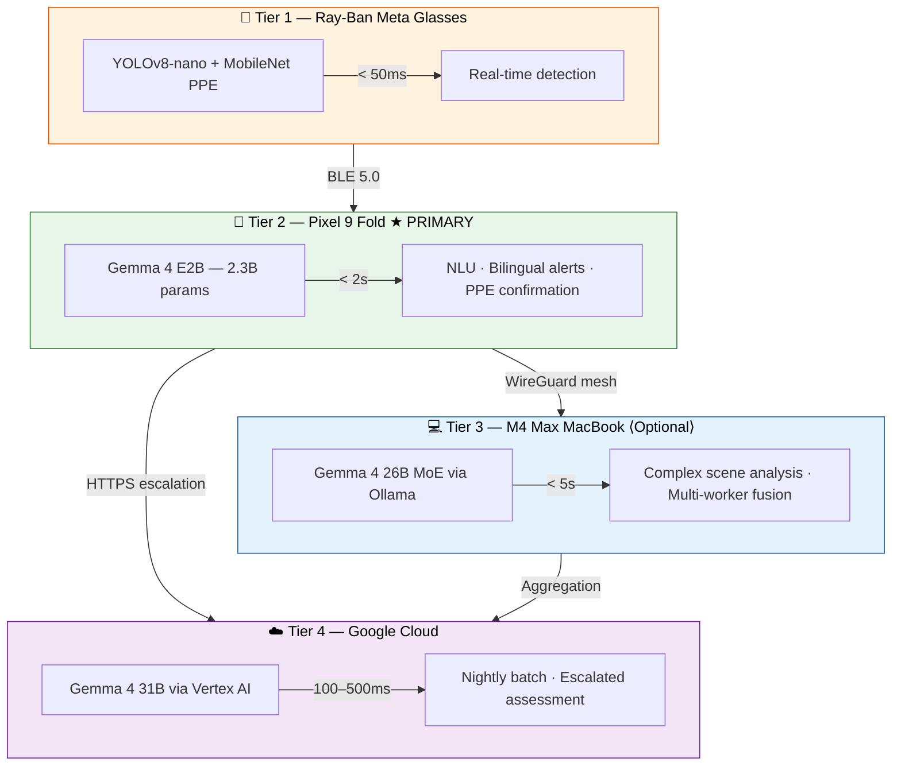

<p align="center">
  <h1 align="center">👷 Duchess</h1>
  <p align="center">
    <strong>AI-powered construction safety — saving lives with Gemma 4 on every worker's phone</strong>
  </p>
  <p align="center">
    <a href="https://github.com/AlexiosBluffMara/Duchess/actions"></a>
    <a href="LICENSE"></a>
    <a href="https://ai.google.dev/gemma"></a>
    <a href="https://kotlinlang.org"></a>
    <a href="https://python.org"></a>
    <a href="https://www.kaggle.com/competitions/gemma-4-good-hackathon"></a>
  </p>
</p>

---

## 🚧 What is Duchess?

**1,056 construction workers died on US job sites in 2022.** Falls, struck-by incidents, electrocutions, and caught-in hazards — the "Fatal Four" — account for over 60% of those deaths. Most are preventable with proper PPE.

Duchess is a **four-tier AI construction safety platform** that puts frontier vision-language models on every worker's phone. Using **Google Gemma 4** for on-device multimodal inference, Duchess detects PPE violations in real-time, delivers **bilingual (English/Spanish) safety alerts**, and keeps all video data on-site — because privacy isn't optional on a union job.

**Core insight**: 30%+ of construction workers are Spanish-speaking. Gemma 4's 140+ language support, combined with on-device inference, means every worker gets instant, private safety intelligence in their language — no cloud round-trip required.

---

## 🏗️ Architecture

Duchess uses a four-tier inference hierarchy that escalates intelligence upward while keeping data local:



**Data flow**: Video never leaves the job site unless Gemma 4 confirms a PPE violation requiring cloud escalation, or during the nightly batch upload after shift ends. All mesh traffic is encrypted with WireGuard — Tailscale cannot decrypt.

---

## ✨ Key Features

| Feature | Description |
|---------|-------------|
| **On-Device AI** | Gemma 4 E2B runs entirely on the companion phone — no internet required for real-time safety inference |
| **Bilingual EN/ES** | All alerts, voice commands, and UI in English and Spanish. Construction-register terminology, not textbook translations |
| **Privacy-First** | Video stays on-site. Worker identifiers anonymized before any cloud upload. HIPAA-compliant for biometric data |
| **Multi-Device Mesh** | Tailscale WireGuard mesh connects all workers on-site. Geospatial tracking enables targeted alert delivery to nearest workers |
| **Voice Hazard Reporting** | Workers report hazards by voice in any language — Gemma 4 E2B/E4B audio input with native function calling |
| **Thinking Mode** | Gemma 4's thinking mode produces explainable safety decisions with auditable reasoning chains for compliance |
| **Graceful Degradation** | System works at every tier independently. No internet? Phone keeps running. No glasses? Phone app still detects. |
| **AR Safety Alerts** | PPE violation alerts displayed on Ray-Ban Meta glasses HUD with severity-coded visuals |

---

## 🛠️ Tech Stack

| Category | Technologies |
|----------|-------------|
| **Languages** | Kotlin 2.1, Python 3.11+, TypeScript |
| **Android** | Jetpack Compose, Hilt, Coroutines/Flow, CameraX, Room |
| **ML Models** | Gemma 4 E2B (2.3B), Gemma 4 E4B (4B), Gemma 4 26B MoE, Gemma 4 31B, YOLOv8-nano, MobileNet |
| **Inference** | TensorFlow Lite / LiteRT, Cactus SDK, Ollama, llama.cpp |
| **Training** | Unsloth Dynamic QLoRA, PyTorch, Hugging Face Transformers |
| **Cloud** | Google Cloud: Vertex AI, Cloud Run, Firestore, Cloud Storage |
| **Networking** | Tailscale WireGuard mesh, BLE 5.0, HTTPS |
| **Wearables** | Meta DAT SDK v0.5.0 (Ray-Ban Meta glasses) |
| **CI/CD** | GitHub Actions, Gradle (Kotlin DSL), Poetry |
| **Quantization** | GGUF (llama.cpp), LiteRT FP16/INT8, MLX |

---

## 🏆 Hackathon

Duchess is built for the **[Gemma 4 Good Hackathon](https://www.kaggle.com/competitions/gemma-4-good-hackathon)** by Google & Kaggle.

- **Total prize pool**: $200,000
- **Deadline**: May 18, 2026
- **Target tracks**: Main Track, Safety & Trust, Digital Equity & Inclusivity, Cactus, Unsloth, LiteRT

We believe construction safety is a perfect fit for Gemma 4 Good — it's a life-or-death problem where on-device multilingual AI directly saves lives.

---

## 🚀 Quick Start

### Prerequisites

- Android Studio Ladybug+ (for companion phone app)
- JDK 17+
- Python 3.11+ with [Poetry](https://python-poetry.org/)
- [Ollama](https://ollama.com/) (optional, for local Tier 3 inference)
- GitHub PAT with `read:packages` scope (for Meta DAT SDK)

### Setup

```bash
# Clone the repository
git clone https://github.com/AlexiosBluffMara/Duchess.git
cd Duchess

# Phone app — create local.properties with your GitHub token
cp app-phone/local.properties.example app-phone/local.properties
# Edit app-phone/local.properties and add your github_token

# Phone app — build
cd app-phone
./gradlew assembleDebug

# ML pipeline — install dependencies
cd ../ml
poetry install

# Cloud infrastructure — install dependencies
cd ../cloud
poetry install

# (Optional) Pull Gemma 4 for local inference
ollama pull gemma4:e2b
```

---

## 📁 Project Structure

```
Duchess/
├── app-phone/          # 📱 Companion phone app (Kotlin, Jetpack Compose, Gemma 4 E2B)
├── app-glasses/        # 🥽 Ray-Ban Meta glasses app (Kotlin, YOLOv8-nano, Meta DAT SDK)
├── ml/                 # 🧠 ML training pipeline (Unsloth QLoRA, dataset prep, benchmarks)
├── cloud/              # ☁️ Cloud infrastructure (Google Cloud, Vertex AI, nightly batch)
├── docs/               # 📖 Documentation & GitHub Pages site
├── specs/              # 📋 Feature specifications
├── scripts/            # 🔧 Dev tooling & automation
├── AGENTS.md           # Agent team architecture
└── HACKATHON_STRATEGY.md
```

---

## 📖 Documentation

Full documentation is available at **[alexiosbluffmara.github.io/Duchess](https://alexiosbluffmara.github.io/Duchess/)**, including:

- Architecture deep-dives for each tier
- Gemma 4 integration guide and benchmarks
- PPE detection pipeline walkthrough
- Bilingual localization reference
- API documentation

---

## 🤖 Built with 15 AI Agents

Duchess is developed by a coordinated team of 15 specialized AI agents — each with deep domain expertise in construction safety, Android development, ML training, edge inference, networking, bilingual localization, and more. The agent team is orchestrated by **Duke**, the project coordinator, and documented in [AGENTS.md](AGENTS.md).

---

## 👥 Team

**Bhattacharya, Baksi, Lahiri**

Illinois State University · [Alexios Bluff Mara LLC](https://github.com/AlexiosBluffMara)

---

## 📄 License

This project is licensed under the **Apache License 2.0** — see [LICENSE](LICENSE) for details.

---

## 🙏 Acknowledgments

- **[Google DeepMind](https://deepmind.google/)** — Gemma 4 model family powering on-device and cloud inference
- **[Kaggle](https://www.kaggle.com/)** — Hosting the Gemma 4 Good Hackathon
- **[Meta](https://about.meta.com/)** — DAT SDK and Ray-Ban Meta smart glasses platform
- **[Unsloth](https://unsloth.ai/)** — Dynamic QLoRA for efficient fine-tuning
- **[Cactus](https://cactus.ai/)** — On-device model routing SDK
- **[Tailscale](https://tailscale.com/)** — WireGuard mesh networking
- **Dr. Mangolika Bhattacharya** and **Dr. Haiyan Sally Xie** — Faculty advisors, Illinois State University
- **OSHA** — Construction safety standards and Fatal Four data

---

<p align="center">
  <em>Because every worker deserves to go home safe — in any language.</em>
</p>
