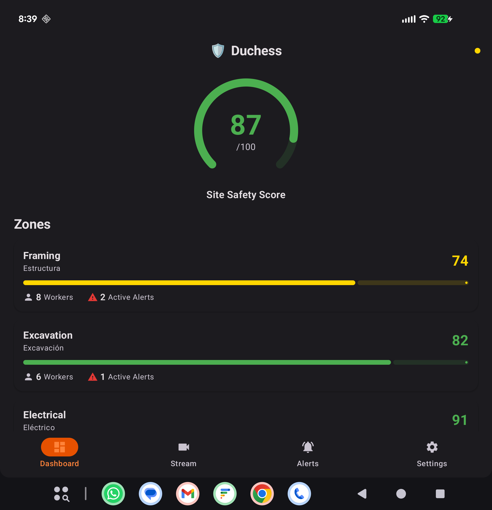
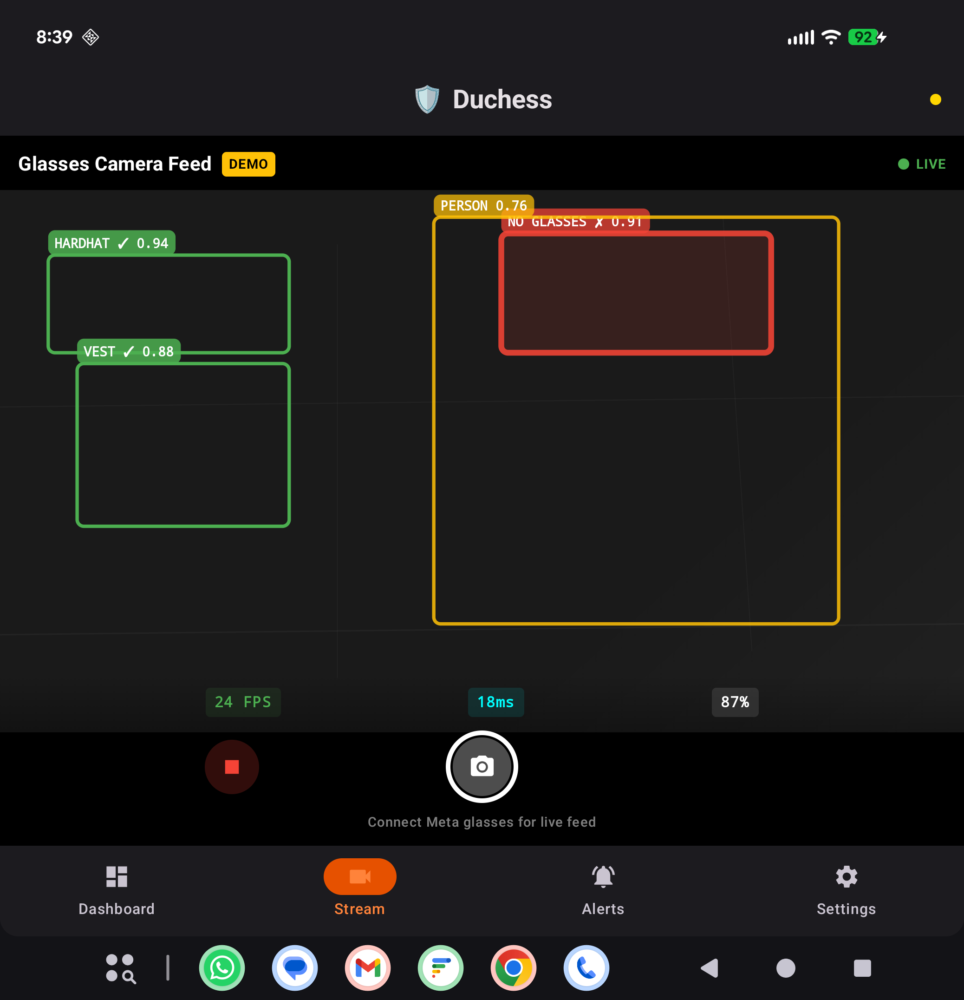
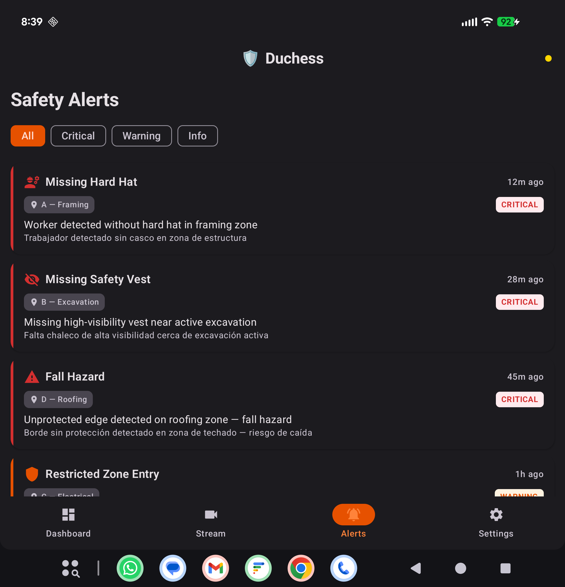
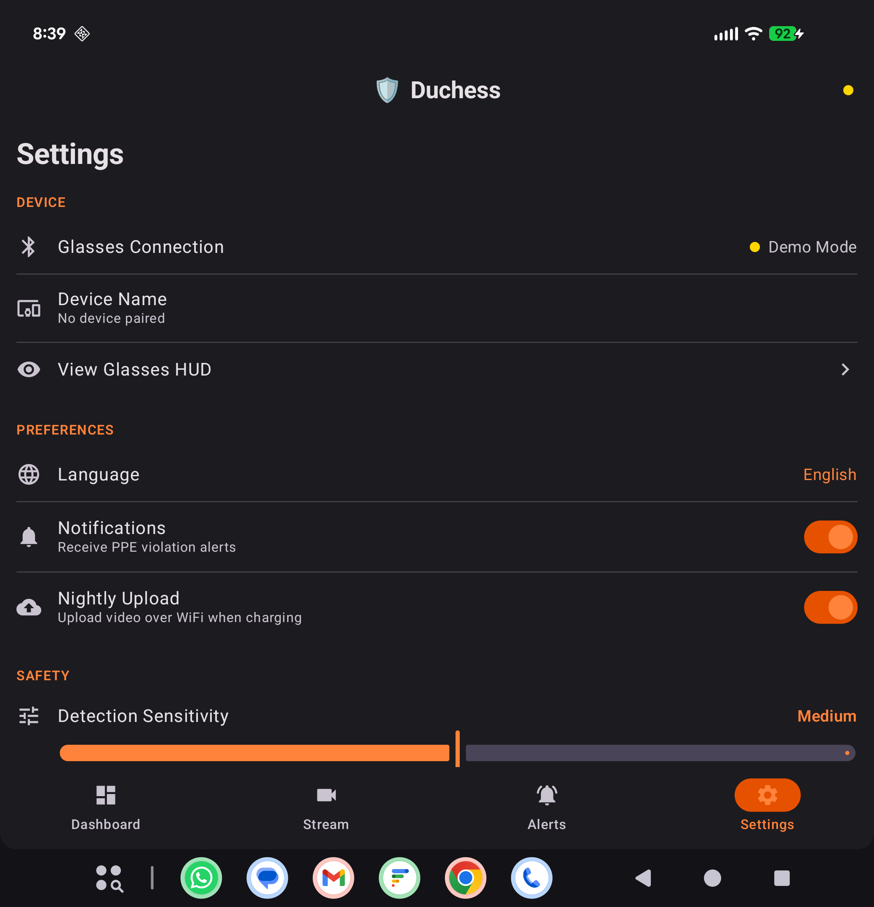
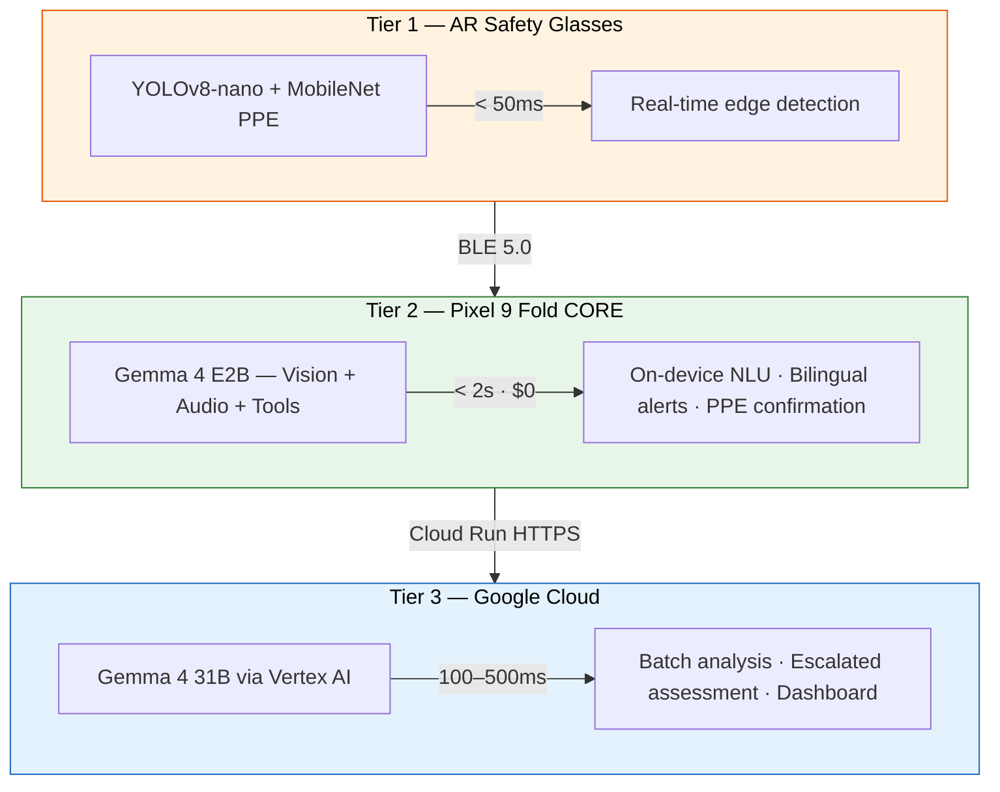

<p align="center">
  <h1 align="center">Duchess</h1>
  <p align="center">
    <strong>AI-powered construction safety — saving lives with Gemma 4 on every worker's phone</strong><br>
    <em>Seguridad impulsada por IA — salvando vidas con Gemma 4 en el teléfono de cada trabajador</em>
  </p>
  <p align="center">
    <a href="https://github.com/AlexiosBluffMara/Duchess/actions"></a>
    <a href="LICENSE"></a>
    <a href="https://ai.google.dev/gemma"></a>
    <a href="https://kotlinlang.org"></a>
    <a href="https://python.org"></a>
    <a href="https://www.kaggle.com/competitions/gemma-4-good-hackathon"></a>
  </p>
</p>

---

## App Screenshots — Running on Pixel 9 Fold

<p align="center">
  
  &nbsp;&nbsp;
  
  &nbsp;&nbsp;
  
  &nbsp;&nbsp;
  
</p>

<p align="center">
  <em>Dashboard · Stream (24 FPS, 18ms) · Safety Alerts · Settings</em><br>
  <em>Tablero · Transmisión (24 FPS, 18ms) · Alertas de seguridad · Configuración</em>
</p>

---

## What is Duchess?

**1,056 construction workers died on US job sites in 2022.** Falls, struck-by incidents, electrocutions, and caught-in hazards — the "Fatal Four" — account for over 60% of those deaths. Most are preventable with proper PPE.

Duchess is a **three-tier AI construction safety platform** that puts frontier vision-language models on every worker's phone. Using **Google Gemma 4** for on-device multimodal inference, Duchess detects PPE violations in real-time, delivers **bilingual (English/Spanish) safety alerts**, and keeps all video data on-site — because privacy isn't optional on a union job.

**Core insight**: 30%+ of construction workers are Spanish-speaking. Gemma 4's 140+ language support, combined with on-device inference, means every worker gets instant, private safety intelligence in their language — no cloud round-trip required.

---

## Architecture — Three Tiers, No Local Server

```
Tier 1: AR Glasses (Vuzix M400 + Oakley/Ray-Ban)    → YOLOv8-nano PPE    (<50ms)
Tier 2: Pixel 9 Fold (ON-DEVICE INFERENCE, $0/query) → Gemma 4 E2B        (<2s)
Tier 3: Google Cloud (Vertex AI)                      → Gemma 4 31B        (100-500ms)
```



**Why no local server (Tier 3)?** It doesn't scale. A MacBook on a jobsite is fragile infrastructure. The phone handles 95% of inference at $0/query. The remaining 5% of escalated detections go straight to Vertex AI in the cloud. Simpler, cheaper, more reliable.

**Data flow**: Video never leaves the job site unless Gemma 4 confirms a PPE violation requiring cloud escalation. All mesh traffic is WireGuard-encrypted.

---

## Two Paths of AR Glasses

| Path | Hardware | Status | SDK | On-Device ML |
|------|----------|--------|-----|-------------|
| **A — Vuzix M400** | Industrial AR glasses (AOSP) | Acquiring (faculty meeting tomorrow) | Vuzix SDK, Camera2, LiteRT | YOLOv8-nano INT8 PPE detection |
| **B — Oakley / Ray-Ban** | Consumer smart glasses | **In hand** (Meta Wayfarers) | Meta DAT SDK v0.5.0 | Camera stream → phone via BLE |

Both paths are first-class citizens in the codebase. Path B (Ray-Ban Wayfarers) is our hackathon prototyping hardware.

---

## Gemma 4 — On-Device Inference Station

The Pixel 9 Fold runs **Gemma 4 E2B entirely on-device** as a zero-cost inference station:

| Capability | How Duchess Uses It |
|-----------|-------------------|
| **Multimodal Vision** | Processes camera frames at 640x640 — detects missing hard hats directly |
| **Native Function Calling** | `create_safety_alert(type, severity, zone)` — structured output, no JSON fragility |
| **Audio Input** | Workers report hazards by voice in any language — no STT pipeline needed |
| **Thinking Mode** | Auditable reasoning: "OSHA 1926.502 requires fall protection above 6 feet" |
| **128K Context** | Multi-frame temporal reasoning across video sequences |
| **140+ Languages** | Bilingual EN/ES in a single forward pass. Construction-register Spanish. |
| **Tool Use** | Triggers BLE alerts, queues cloud escalation, writes to local DB — autonomously |

---

## Google Cloud Services (Tier 3)

| Service | Purpose |
|---------|---------|
| **Vertex AI** | Gemma 4 31B endpoint for escalated inference + batch prediction |
| **Cloud Run** | Serverless escalation API (receives alerts from phones) |
| **Cloud Storage** | Encrypted video storage with 90-day lifecycle |
| **Firestore** | Real-time alert database synced to all devices |
| **Pub/Sub** | Escalation queue with exactly-once delivery |
| **Firebase Auth + FCM** | Device registration + push notifications to supervisors |
| **Secret Manager** | Credentials, API keys, model configs — no secrets in code |

**Hackathon demo cost**: ~$50-100 total for the competition period.

---

## ML Research — Quantization & Fine-Tuning

Duchess treats on-device inference as a first-class research problem. Fitting a frontier vision-language model on a phone with zero cloud cost requires a multi-stage compression pipeline — from training-time quantization through post-training compression to hardware-specific export. Every technique below is part of a single coherent pipeline, not an isolated experiment.

### The Duchess Quantization Pipeline

```
Gemma 4 E2B (BF16, 10.2 GB)
    │
    ▼
Unsloth Dynamic QLoRA Fine-Tuning ─── construction safety + bilingual data
    │                                  4.1 GB VRAM, ~16 hrs on RTX 5090
    ▼
LoRA Adapter Merge ─────────────────── fold adapter weights into base model
    │                                  back to 10.2 GB, now domain-adapted
    ▼
AWQ Post-Training Quantization ─────── 128 calibration samples, per-channel scaling
    │                                  mixed-precision: attn INT8, FFN INT4, router FP16
    ▼
LiteRT Export ──────────────────────── Tensor G4 NPU-optimized, ~2.8 GB final
```

**Critical ordering**: Adapter merge MUST happen before post-training quantization. Quantizing first then merging produces a FP16 result (defeating quantization) or introduces double quantization error. Merging first ensures AWQ calibrates on the domain-adapted weight distribution.

### 1. Unsloth Dynamic QLoRA

**QLoRA** (Dettmers et al., NeurIPS 2023) quantizes base model weights to 4-bit NormalFloat (NF4) — an information-theoretically optimal data type for normally-distributed weights — while training full-precision LoRA adapter matrices. The weight update decomposes as:

```
W' = W_frozen_NF4 + (α/r) · B·A
```

where `W_frozen` is dequantized to BF16 for each forward pass, `A ∈ R^{d_in×r}`, `B ∈ R^{r×d_out}`, and `r ≪ min(d_in, d_out)`. Only A and B are trainable. Double quantization further compresses the NF4 scaling constants from FP32 to FP8 (0.5 → 0.25 extra bits per parameter).

**Unsloth's "Dynamic" enhancement** adds two key innovations over standard QLoRA:

1. **Per-layer precision allocation**: Profiles each layer's Hessian trace to assign bit-widths dynamically. High-sensitivity layers (embeddings, first/last decoder layers) retain 8-bit or BF16 precision; low-sensitivity middle layers use NF4. This is conceptually similar to SqueezeLLM's sensitivity analysis but applied during training.

2. **Fused Triton kernels**: Custom GPU kernels fuse NF4 dequantization + LoRA forward into a single pass, avoiding materialization of the full BF16 weight matrix. Combined with fused RoPE and in-place cross-entropy (avoiding the `vocab_size × seq_len` logit tensor), this eliminates ~40% of kernel launches.

**Memory comparison for Gemma 4 E2B (2.3B effective, 5.1B total with MoE)**:

| Component | Full BF16 | Standard QLoRA | Unsloth Dynamic |
|-----------|-----------|----------------|-----------------|
| Base weights | 10.2 GB | 2.65 GB (NF4) | ~2.4 GB (mixed NF4/8-bit) |
| LoRA adapters (r=16) | — | 26 MB | 26 MB |
| Optimizer states | 40.8 GB | 104 MB | 104 MB |
| Activations (seq=2048, bs=4) | 3.2 GB | 3.2 GB | ~1.6 GB (fused) |
| **Total VRAM** | **54.2 GB** | **6.0 GB** | **4.1 GB** |

This means Gemma 4 E2B fine-tuning fits on a single RTX 4090 (24 GB) with room to spare.

**LoRA target modules for vision-language models**: We target all seven linear projections in each transformer block (`q_proj`, `k_proj`, `v_proj`, `o_proj`, `gate_proj`, `up_proj`, `down_proj`). The FFN layers (`gate/up/down_proj`) are critical for domain knowledge storage and improve construction safety accuracy by 2-4% over attention-only LoRA. The ViT vision encoder is **not** adapted — SigLIP features generalize well to construction imagery, and perturbing vision representations without retraining the cross-modal projection layer risks breaking alignment.

**MoE-specific consideration**: Gemma 4's MoE experts each have independent FFN weights. LoRA is applied to ALL experts (not just the router), because different experts activate for different token types. The router itself trains at full precision — it's a small linear layer where quantization errors can flip discrete routing decisions.

**Adapter stacking**: We train a single multi-task adapter (r=32) on combined safety + bilingual + engineering data, with optional specialized adapters (r=8) for specific jobsite types that can be hot-swapped at inference time.

**The "0% accuracy loss" claim**: Validated on text benchmarks (MMLU, HellaSwag). For multimodal tasks, we expect 0.5-2% degradation on VQA benchmarks (Shen et al., 2024) because cross-modal attention layers are more sensitive to quantization noise than self-attention. We mitigate this by keeping the vision-language projection and first/last two transformer layers at 8-bit precision.

### 2. TurboQuant — Post-Training Quantization

Post-training quantization (PTQ) compresses a trained model without retraining. We evaluate three complementary techniques:

**GPTQ** (Frantar et al., ICLR 2023): One-shot weight quantization using the Optimal Brain Quantizer framework. For each layer, GPTQ solves `argmin_{W_q} ‖WX - W_qX‖²` using the inverse Hessian `H⁻¹ = (XX^T)⁻¹` to compensate for quantization error — adjusting remaining weights in each row after quantizing a column. Processes a 7B model in ~4 minutes on a single A100.

**AWQ** (Lin et al., MLSys 2024): Activation-Aware Weight Quantization. Key insight: 1-3% of weight channels are "salient" (they process high-magnitude activation channels). AWQ applies per-channel scaling to protect salient weights before uniform quantization: `W' = Q(W · diag(s)) · diag(s)⁻¹ · X ≈ W · X`. The scaling factors are optimized via grid search per channel — fast, hardware-agnostic, and slightly more robust than GPTQ at INT4.

**SqueezeLLM** (Kim et al., ICML 2024): Dense-and-sparse decomposition. Instead of uniform quantization everywhere, SqueezeLLM isolates outlier weights (high Fisher information + large magnitude) into a sparse FP16 matrix, then aggressively quantizes the remaining dense matrix to INT3/INT4. The ~0.5% of weights stored in the sparse component recover most accuracy lost from aggressive quantization.

**Hardware-specific precision support**:

| Precision | Tensor G4 NPU (Pixel 9 Fold) | Snapdragon XR1 (Vuzix M400) |
|-----------|-------|-------|
| INT8 | Native, optimal (~10 TOPS) | Hexagon DSP (~2.5 TOPS) |
| INT4 | Supported, packed (~18 TOPS theoretical) | Not native (shader-based) |
| FP16 | Supported (~5 TFLOPS) | Adreno 615 GPU (~300 GFLOPS) |

The Tensor G4 NPU is designed for INT8. INT4 offers higher theoretical throughput but casting overhead for LayerNorm/Softmax/RoPE can negate the advantage at batch=1. **Our recommendation**: INT8 weights + FP16 activations for attention, INT4 weights + INT8 activations for FFN layers.

**Thermal throttling**: The Pixel 9 Fold sustains INT8 NPU inference at ~3.5W indefinitely (no throttling). FP16 on GPU draws ~5.5W and throttles after ~90 seconds. The Vuzix M400 (600 mAh battery, 2.5W TDP) must minimize compute duty cycle — inference only on flagged frames, not continuous video.

### 3. BitNet b1.58 — 1-Bit Ternary Quantization

**Research frontier**: BitNet b1.58 (Ma et al., Microsoft Research, 2024) constrains every linear layer weight to {-1, 0, +1} via absmean quantization:

```
W_ternary = RoundClip(W / γ, -1, 1)    where γ = mean(|W|)
```

Each weight carries log₂(3) = 1.58 bits of information (hence "b1.58"). Packed storage fits 5 ternary values in 8 bits (3⁵ = 243 < 256), achieving 1.6 bits/weight.

**Why this matters**: Ternary multiplication becomes pure addition/subtraction — no FPU required:

```
y_j = Σ_{W=+1}(x_i) - Σ_{W=-1}(x_i)
```

At 7nm, ternary add/sub costs ~0.005 pJ vs FP16 multiply at ~0.15 pJ — a **30× energy reduction**. On ARM NEON (Snapdragon XR1), each 128-bit instruction processes 16 INT8 values simultaneously via the integer SIMD pipeline, completely bypassing the FPU.

**Memory math for Gemma 4 E2B**:

```
Linear layer parameters: ~4.2B at 1.6 bits = 840 MB
Embeddings (kept FP16):  ~0.9B at 16 bits  = 1.8 GB
Total: ~2.64 GB   (vs 10.2 GB BF16, vs 2.87 GB NF4)
```

**The fundamental challenge**: BitNet achieves these results by **training from scratch** with ternary constraints using straight-through estimation. Post-training ternarization of a FP16 model causes catastrophic accuracy loss (MMLU drops from ~46% to ~26% on Llama 2 7B). This means we cannot simply ternarize our fine-tuned Gemma 4.

**Vision pathway concerns**: No published results exist for ternary VLMs. The ViT patch embedding layer performs continuous transformations where small weight differences encode subtle visual features (edge orientations, texture gradients). Ternary weights collapse this to a very coarse feature set. We propose a **hybrid architecture**: ViT encoder at INT8, vision-language projection at FP16, language decoder at BitNet b1.58.

**Our planned experiments**:

1. **Hybrid ternarization**: Ternarize only language decoder FFN layers (~60% of parameters) while keeping attention and vision at INT8. Measure PPE detection recall.
2. **Ternary LoRA adapters**: Train LoRA matrices B and A with ternary constraints. Novel approach — preserves base model quality while gaining efficiency at the adapter level.
3. **Knowledge distillation**: Train a 1B-parameter BitNet model from scratch using Gemma 4 E4B as teacher, sidestepping post-training ternarization.
4. **ARM NEON kernels**: Custom ternary matmul for Snapdragon XR1 to validate theoretical speedups on real hardware.

### 4. PrismQuant — Mixed-Precision for MoE

Not all layers tolerate quantization equally. Layer sensitivity approximated by `‖W‖_F · ‖H⁻¹‖_F` shows a consistent pattern across transformer architectures:

| Component | Sensitivity | Recommended Precision |
|-----------|------------|----------------------|
| Embeddings / LM head | Very High | FP16 (always) |
| First 2-3 decoder layers | High | INT8 |
| Middle decoder layers | Low | INT4 |
| Last 2-3 decoder layers | Moderate-High | INT8 |
| MoE router (gating) | Critical | FP16 |
| High-frequency experts | Moderate | INT8 |
| Low-frequency experts | Low | INT4 |
| Attention q/k projections | Moderate-High | INT8 |
| Attention v/o projections | Moderate | INT4-INT8 |
| FFN gate/up/down projections | Low | INT4 |

Gemma 4's MoE architecture creates a unique opportunity: expert utilization is uneven, and low-frequency experts (handling rare tokens) have been updated fewer times during training and are less regularized — counterintuitively, they tolerate more aggressive quantization because the model doesn't rely heavily on their precise values.

**Expected model sizes with mixed-precision**:

| Configuration | Gemma 4 E2B | Gemma 4 E4B |
|--------------|-------------|-------------|
| Original BF16 | 10.2 GB | 18.0 GB |
| AWQ uniform INT4 | 2.9 GB | 5.1 GB |
| PrismQuant mixed (our config) | 2.8 GB | 4.9 GB |
| Hypothetical BitNet b1.58 | 2.1 GB | 3.7 GB |

---

## Training Data — Construction Safety Datasets

Real-world PPE detection requires diverse, high-quality training data spanning conditions that existing academic datasets systematically underrepresent. We combine established benchmarks with targeted collection to build a comprehensive fine-tuning corpus.

### Detection Datasets (Bounding Box Annotations)

| Dataset | Images | Classes | License | Source |
|---------|--------|---------|---------|--------|
| **SHWD** | 7,581 | helmet, head | Mixed | GitHub (njvisionpower) |
| **Hard Hat Workers** | 5,000 | helmet, head, person | CC0 (Public Domain) | Kaggle |
| **Construction-PPE** (Roboflow) | 3,000-8,000 | hardhat, no_hardhat, vest, no_vest, glasses, gloves | CC BY 4.0 (varies) | Roboflow Universe |
| **PICTOR-v3** | 2,000 | hardhat, vest, mask, person | Research | Fang et al. |
| **SODA** | 19,846 | 15 classes (workers, equipment, scaffolding) | Research (apply) | Wang et al., 2022 |
| **SH17** | ~5,000 | helmet, head, person | Academic | Safety Helmet Detection |
| **MOCS** | ~5,300 | worker, helmet, vest, no_helmet | Research | Mining & Oil Construction |
| **CHV** | ~1,000 | hardhat, no_hardhat, person | Research | Hong Kong PolyU |

**Total available**: ~50,000+ images before augmentation.

### VLM Fine-Tuning Pipeline

Detection datasets provide bounding boxes, not natural language. For Gemma 4 vision fine-tuning, we convert detection annotations to instruction-tuning pairs:

```json
{
  "image": "construction_scene_0042.jpg",
  "instruction": "Analyze this construction scene for PPE violations and safety hazards.",
  "output": {
    "tool_calls": [{
      "name": "create_safety_alert",
      "arguments": {
        "violation": "no_hardhat",
        "severity": 3,
        "description_en": "Worker on scaffolding at ~15ft without hard hat — OSHA 1926.100",
        "description_es": "Trabajador en andamio a ~5m sin casco — OSHA 1926.100",
        "confidence": 0.87
      }
    }]
  }
}
```

We use Gemma 4's native **function-calling format** (not JSON-in-string) to teach the model structured output directly. This eliminates brittle JSON parsing at inference time.

### Training Data Composition

```
40% — Construction safety scenarios (English)
       PPE violation descriptions, hazard identification, OSHA regulation Q&A
30% — Same scenarios (Spanish, construction register)
       Mexican/Central American construction jargon, code-switching examples
20% — Visual description + multi-step reasoning chains
       "I see X, therefore risk Y because OSHA standard Z"
10% — General instruction following (prevents catastrophic forgetting)
```

**Bilingual nuance**: Construction Spanish on US jobsites uses domain-specific vocabulary that differs from textbook translations:

| English | Standard Spanish | Construction Register |
|---------|-----------------|----------------------|
| Hard hat | Casco de seguridad | Casco duro |
| Scaffolding | Andamiaje | Andamio / el scaffold |
| Drywall | Panel de yeso | Drywall / tablarroca |
| Forklift | Carretilla elevadora | Montacargas / forklift |

### Critical Dataset Gaps (Research Contribution)

Existing datasets systematically fail to represent conditions that matter for real deployment:

| Gap | Severity | Status | Impact |
|-----|----------|--------|--------|
| **Night / low-light construction** | Critical | No existing PPE dataset covers nighttime scenes | Night shifts (highway, emergency repairs) have different noise/IR/reflective-tape characteristics |
| **Ego-centric camera perspective** | Critical | Zero datasets use wearable/glasses-mounted cameras | All existing data is surveillance (top-down) or handheld (mid-height). Our glasses see PPE from eye-level with ego-motion blur |
| **Adverse weather** (rain, fog, dust) | High | No major construction PPE dataset includes weather degradation | Rain on lenses, fog reducing contrast, demolition dust clouds |
| **Multi-ethnic workforce** | High | Most datasets sourced from Chinese construction sites | US construction is 30%+ Hispanic/Latino (BLS). Models trained on one demographic may have lower accuracy for others |
| **Partial occlusion** | High | Most datasets show unoccluded workers | Real sites have scaffolding, formwork, rebar, equipment blocking views |
| **Distance variation** | Medium | Most data is 10-30m surveillance range | Glasses camera produces 1-3m close-ups; surveillance data doesn't represent this |
| **Full OSHA PPE suite** | Medium | Most datasets cover helmets only | Real compliance requires hardhat + vest + glasses + gloves + boots + harness + hearing protection |

**Our contribution**: Collecting 500-1,000 ego-centric construction images from safety glasses perspective with PPE annotations would be a novel dataset contribution and a potential workshop paper at venues like CVPR (Vision for Infrastructure Safety) or Automation in Construction.

### Key References

- Fang, W. et al. "Detecting non-hardhat-use by a deep learning method from far-field surveillance videos." *Automation in Construction*, 2018.
- Wang, Z. et al. "SODA: A large-scale open site object detection dataset." *Advanced Engineering Informatics*, 2022.
- Nath, N.D. et al. "Deep learning for site safety: Real-time detection of PPE." *Automation in Construction*, 2020.
- Dettmers, T. et al. "QLoRA: Efficient Finetuning of Quantized LLMs." *NeurIPS*, 2023.
- Frantar, E. et al. "GPTQ: Accurate Post-Training Quantization for GPT." *ICLR*, 2023.
- Lin, J. et al. "AWQ: Activation-Aware Weight Quantization." *MLSys*, 2024.
- Ma, S. et al. "The Era of 1-bit LLMs: All Large Language Models are in 1.58 Bits." *Microsoft Research*, 2024.
- Kim, S. et al. "SqueezeLLM: Dense-and-Sparse Quantization." *ICML*, 2024.

---

## Key Features

| Feature | Description |
|---------|-------------|
| **On-Device AI ($0/inference)** | Gemma 4 E2B runs entirely on-device via LiteRT. No internet required. |
| **Bilingual EN/ES** | All alerts, voice commands, and UI in English and Spanish. Construction-register terminology. |
| **Privacy-First** | Video stays on-site. Worker identifiers anonymized before any cloud upload. |
| **Function Calling** | Gemma 4 produces typed safety assessments. No fragile JSON parsing. |
| **Thinking Mode** | Explainable, auditable reasoning chains for OSHA compliance. |
| **Voice Hazard Reporting** | Workers report hazards by voice in any language via Gemma 4 E2B audio. |
| **AR Safety Alerts** | PPE violation alerts on glasses HUD with severity-coded bilingual text. |
| **Graceful Degradation** | Every tier works independently. No internet? Phone keeps running. |

---

## Tech Stack

| Category | Technologies |
|----------|-------------|
| **Languages** | Kotlin 2.1, Python 3.11+ |
| **Android** | Jetpack Compose, Hilt, Coroutines/Flow, CameraX, Room |
| **ML Models** | Gemma 4 E2B (2.3B), Gemma 4 E4B (4B), Gemma 4 31B, YOLOv8-nano |
| **On-Device** | LiteRT, MediaPipe LlmInference, Tensor G4 NPU |
| **Training** | Unsloth Dynamic QLoRA, PyTorch, HuggingFace Transformers |
| **Cloud** | Google Cloud: Vertex AI, Cloud Run, Firestore, Cloud Storage, Pub/Sub, Firebase |
| **Networking** | Tailscale WireGuard mesh, BLE 5.0, HTTPS |
| **Wearables** | Meta DAT SDK v0.5.0 (Ray-Ban), Vuzix SDK (M400) |
| **CI/CD** | GitHub Actions, Gradle (Kotlin DSL), Poetry |
| **Quantization** | Unsloth QLoRA, GPTQ, AWQ, BitNet b1.58, LiteRT INT8/FP16 |

---

## Hackathon

Duchess is built for the **[Gemma 4 Good Hackathon](https://www.kaggle.com/competitions/gemma-4-good-hackathon)** by Google & Kaggle.

- **Total prize pool**: $200,000
- **Deadline**: May 18, 2026
- **Primary targets**: Main Track ($50K), Safety & Trust ($10K), Digital Equity ($10K), Unsloth ($10K)
- **Secondary targets**: LiteRT ($10K), Cactus ($10K), Global Resilience ($10K)

We believe construction safety is a perfect fit for Gemma 4 Good — it's a life-or-death problem where on-device multilingual AI directly saves lives.

---

## Quick Start

### Prerequisites

- Android Studio Ladybug+ (for companion phone app)
- JDK 17+
- Python 3.11+ with [Poetry](https://python-poetry.org/)
- GitHub PAT with `read:packages` scope (for Meta DAT SDK)
- Google Cloud project with Vertex AI API enabled (for Tier 3)

### Setup

```bash
# Clone the repository
git clone https://github.com/AlexiosBluffMara/Duchess.git
cd Duchess

# Phone app — create local.properties with your GitHub token
cp app-phone/local.properties.example app-phone/local.properties
# Edit local.properties: add github_token, github_user, sdk.dir

# Build phone app
./scripts/build-phone.sh

# Build glasses app (Vuzix M400)
./scripts/build-glasses.sh

# Install on connected devices
./scripts/install.sh

# ML pipeline
cd ml && poetry install

# Download real PPE detection model
python3 scripts/download-ppe-model.py
```

---

## Project Structure

```
Duchess/
├── app-phone/          Companion phone app (Kotlin, Compose, Gemma 4 E2B)
├── app-glasses/        AR glasses app (Kotlin, YOLOv8-nano, Camera2/DAT SDK)
├── ml/                 ML training pipeline (Unsloth QLoRA, quantization research)
├── cloud/              AWS CDK stack (legacy — migrating to Google Cloud)
├── cloud-gcp/          Google Cloud infrastructure (Vertex AI, Cloud Run, Firestore)
├── docs/               GitHub Pages site
├── specs/              Feature specifications
├── scripts/            Build, install, and model download scripts
├── .memory/            Shared context between Claude Code + GitHub Copilot
├── HACKATHON_STRATEGY.md   Prize targeting and timeline
└── AGENTS.md           15 AI specialist agents
```

---

## Documentation

Full documentation at **[alexiosbluffmara.github.io/Duchess](https://alexiosbluffmara.github.io/Duchess/)**, including:

- Three-tier architecture deep-dive
- Gemma 4 on-device capabilities and benchmarks
- Google Cloud (Vertex AI) deployment guide
- PPE detection pipeline walkthrough
- Bilingual localization reference / Referencia de localización bilingüe
- Quantization research results

---

## Team

**Bhattacharya, Lahiri**

Illinois State University · Department of Technology · [Alexios Bluff Mara LLC](https://github.com/AlexiosBluffMara)

**Faculty Advisors**: Dr. Mangolika Bhattacharya (IoT/AI) · Dr. Haiyan Sally Xie (Construction Digital Twins, 791+ citations)

---

## License

This project is licensed under the **Apache License 2.0** — see [LICENSE](LICENSE) for details.

---

## Acknowledgments

- **[Google DeepMind](https://deepmind.google/)** — Gemma 4 model family
- **[Kaggle](https://www.kaggle.com/)** — Gemma 4 Good Hackathon
- **[Google Cloud](https://cloud.google.com/)** — Vertex AI, Cloud Run, Firestore, Firebase
- **[Meta](https://about.meta.com/)** — DAT SDK and Ray-Ban Meta smart glasses
- **[Unsloth](https://unsloth.ai/)** — Dynamic QLoRA fine-tuning
- **[Vuzix](https://www.vuzix.com/)** — M400 industrial AR glasses
- **[Tailscale](https://tailscale.com/)** — WireGuard mesh networking
- **OSHA** — Construction safety standards and Fatal Four data

---

<p align="center">
  <em>Because every worker deserves to go home safe — in any language.</em><br>
  <em>Porque cada trabajador merece volver a casa seguro — en cualquier idioma.</em>
</p>
