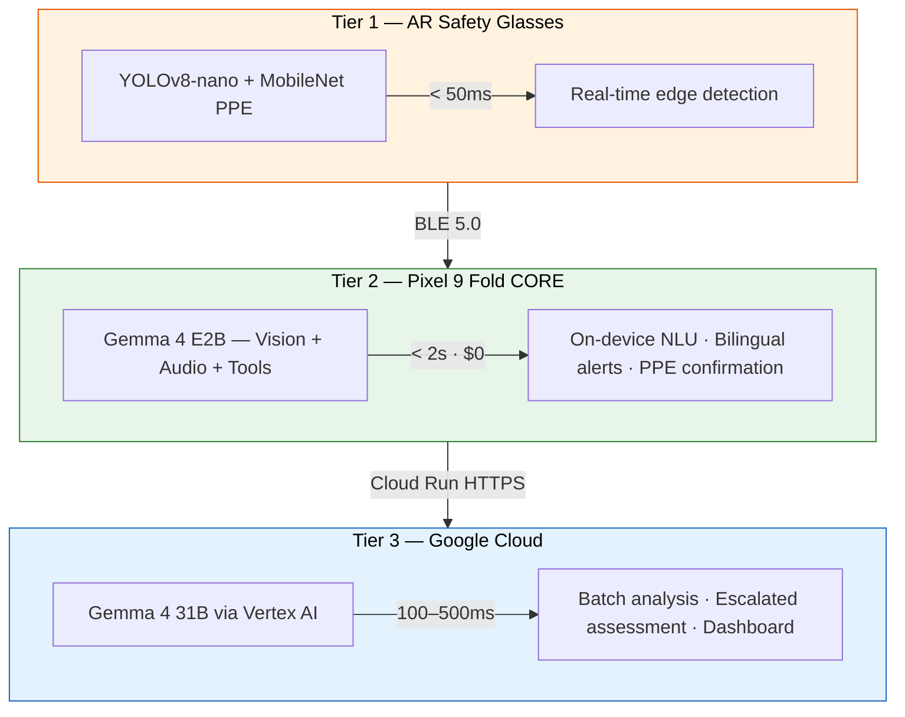

<p align="center">
  <h1 align="center">Duchess</h1>
  <p align="center">
    <strong>AI-powered construction safety — saving lives with Gemma 4 on every worker's phone</strong><br>
    <em>Seguridad impulsada por IA — salvando vidas con Gemma 4 en el teléfono de cada trabajador</em>
  </p>
  <p align="center">
    <a href="https://github.com/AlexiosBluffMara/Duchess/actions"></a>
    <a href="LICENSE"></a>
    <a href="https://ai.google.dev/gemma"></a>
    <a href="https://kotlinlang.org"></a>
    <a href="https://python.org"></a>
    <a href="https://www.kaggle.com/competitions/gemma-4-good-hackathon"></a>
  </p>
</p>

---

## What is Duchess?

**1,056 construction workers died on US job sites in 2022.** Falls, struck-by incidents, electrocutions, and caught-in hazards — the "Fatal Four" — account for over 60% of those deaths. Most are preventable with proper PPE.

Duchess is a **three-tier AI construction safety platform** that puts frontier vision-language models on every worker's phone. Using **Google Gemma 4** for on-device multimodal inference, Duchess detects PPE violations in real-time, delivers **bilingual (English/Spanish) safety alerts**, and keeps all video data on-site — because privacy isn't optional on a union job.

**Core insight**: 30%+ of construction workers are Spanish-speaking. Gemma 4's 140+ language support, combined with on-device inference, means every worker gets instant, private safety intelligence in their language — no cloud round-trip required.

---

## Architecture — Three Tiers, No Local Server

```
Tier 1: AR Glasses (Vuzix M400 + Oakley/Ray-Ban)    → YOLOv8-nano PPE    (<50ms)
Tier 2: Pixel 9 Fold (ON-DEVICE INFERENCE, $0/query) → Gemma 4 E2B        (<2s)
Tier 3: Google Cloud (Vertex AI)                      → Gemma 4 31B        (100-500ms)
```



**Why no local server (Tier 3)?** It doesn't scale. A MacBook on a jobsite is fragile infrastructure. The phone handles 95% of inference at $0/query. The remaining 5% of escalated detections go straight to Vertex AI in the cloud. Simpler, cheaper, more reliable.

**Data flow**: Video never leaves the job site unless Gemma 4 confirms a PPE violation requiring cloud escalation. All mesh traffic is WireGuard-encrypted.

---

## Two Paths of AR Glasses

| Path | Hardware | Status | SDK | On-Device ML |
|------|----------|--------|-----|-------------|
| **A — Vuzix M400** | Industrial AR glasses (AOSP) | Acquiring (faculty meeting tomorrow) | Vuzix SDK, Camera2, LiteRT | YOLOv8-nano INT8 PPE detection |
| **B — Oakley / Ray-Ban** | Consumer smart glasses | **In hand** (Meta Wayfarers) | Meta DAT SDK v0.5.0 | Camera stream → phone via BLE |

Both paths are first-class citizens in the codebase. Path B (Ray-Ban Wayfarers) is our hackathon prototyping hardware.

---

## Gemma 4 — On-Device Inference Station

The Pixel 9 Fold runs **Gemma 4 E2B entirely on-device** as a zero-cost inference station:

| Capability | How Duchess Uses It |
|-----------|-------------------|
| **Multimodal Vision** | Processes camera frames at 640x640 — detects missing hard hats directly |
| **Native Function Calling** | `create_safety_alert(type, severity, zone)` — structured output, no JSON fragility |
| **Audio Input** | Workers report hazards by voice in any language — no STT pipeline needed |
| **Thinking Mode** | Auditable reasoning: "OSHA 1926.502 requires fall protection above 6 feet" |
| **128K Context** | Multi-frame temporal reasoning across video sequences |
| **140+ Languages** | Bilingual EN/ES in a single forward pass. Construction-register Spanish. |
| **Tool Use** | Triggers BLE alerts, queues cloud escalation, writes to local DB — autonomously |

---

## Google Cloud Services (Tier 3)

| Service | Purpose |
|---------|---------|
| **Vertex AI** | Gemma 4 31B endpoint for escalated inference + batch prediction |
| **Cloud Run** | Serverless escalation API (receives alerts from phones) |
| **Cloud Storage** | Encrypted video storage with 90-day lifecycle |
| **Firestore** | Real-time alert database synced to all devices |
| **Pub/Sub** | Escalation queue with exactly-once delivery |
| **Firebase Auth + FCM** | Device registration + push notifications to supervisors |
| **Secret Manager** | Credentials, API keys, model configs — no secrets in code |

**Hackathon demo cost**: ~$50-100 total for the competition period.

---

## ML Research — Quantization & Fine-Tuning

| Technique | Target | Status |
|-----------|--------|--------|
| **Unsloth Dynamic QLoRA** | Fine-tune Gemma 4 E2B for construction safety vision | $10K Unsloth Prize |
| **TurboQuant (GPTQ/AWQ)** | INT8 vs INT4 vs FP16 on Tensor G4 NPU benchmarks | $10K LiteRT Prize |
| **BitNet b1.58 (1-bit ternary)** | Weights {-1, 0, +1} — 10x memory reduction research | Research frontier |
| **PrismQuant (mixed precision)** | Per-layer bit-width allocation for MoE architectures | Research frontier |

All experiments produce paper-ready ablation studies with published weights on HuggingFace.

---

## Key Features

| Feature | Description |
|---------|-------------|
| **On-Device AI ($0/inference)** | Gemma 4 E2B runs entirely on-device via LiteRT. No internet required. |
| **Bilingual EN/ES** | All alerts, voice commands, and UI in English and Spanish. Construction-register terminology. |
| **Privacy-First** | Video stays on-site. Worker identifiers anonymized before any cloud upload. |
| **Function Calling** | Gemma 4 produces typed safety assessments. No fragile JSON parsing. |
| **Thinking Mode** | Explainable, auditable reasoning chains for OSHA compliance. |
| **Voice Hazard Reporting** | Workers report hazards by voice in any language via Gemma 4 E2B audio. |
| **AR Safety Alerts** | PPE violation alerts on glasses HUD with severity-coded bilingual text. |
| **Graceful Degradation** | Every tier works independently. No internet? Phone keeps running. |

---

## Tech Stack

| Category | Technologies |
|----------|-------------|
| **Languages** | Kotlin 2.1, Python 3.11+ |
| **Android** | Jetpack Compose, Hilt, Coroutines/Flow, CameraX, Room |
| **ML Models** | Gemma 4 E2B (2.3B), Gemma 4 E4B (4B), Gemma 4 31B, YOLOv8-nano |
| **On-Device** | LiteRT, MediaPipe LlmInference, Tensor G4 NPU |
| **Training** | Unsloth Dynamic QLoRA, PyTorch, HuggingFace Transformers |
| **Cloud** | Google Cloud: Vertex AI, Cloud Run, Firestore, Cloud Storage, Pub/Sub, Firebase |
| **Networking** | Tailscale WireGuard mesh, BLE 5.0, HTTPS |
| **Wearables** | Meta DAT SDK v0.5.0 (Ray-Ban), Vuzix SDK (M400) |
| **CI/CD** | GitHub Actions, Gradle (Kotlin DSL), Poetry |
| **Quantization** | Unsloth QLoRA, GPTQ, AWQ, BitNet b1.58, LiteRT INT8/FP16 |

---

## Hackathon

Duchess is built for the **[Gemma 4 Good Hackathon](https://www.kaggle.com/competitions/gemma-4-good-hackathon)** by Google & Kaggle.

- **Total prize pool**: $200,000
- **Deadline**: May 18, 2026
- **Primary targets**: Main Track ($50K), Safety & Trust ($10K), Digital Equity ($10K), Unsloth ($10K)
- **Secondary targets**: LiteRT ($10K), Cactus ($10K), Global Resilience ($10K)

We believe construction safety is a perfect fit for Gemma 4 Good — it's a life-or-death problem where on-device multilingual AI directly saves lives.

---

## Quick Start

### Prerequisites

- Android Studio Ladybug+ (for companion phone app)
- JDK 17+
- Python 3.11+ with [Poetry](https://python-poetry.org/)
- GitHub PAT with `read:packages` scope (for Meta DAT SDK)
- Google Cloud project with Vertex AI API enabled (for Tier 3)

### Setup

```bash
# Clone the repository
git clone https://github.com/AlexiosBluffMara/Duchess.git
cd Duchess

# Phone app — create local.properties with your GitHub token
cp app-phone/local.properties.example app-phone/local.properties
# Edit local.properties: add github_token, github_user, sdk.dir

# Build phone app
./scripts/build-phone.sh

# Build glasses app (Vuzix M400)
./scripts/build-glasses.sh

# Install on connected devices
./scripts/install.sh

# ML pipeline
cd ml && poetry install

# Download real PPE detection model
python3 scripts/download-ppe-model.py
```

---

## Project Structure

```
Duchess/
├── app-phone/          Companion phone app (Kotlin, Compose, Gemma 4 E2B)
├── app-glasses/        AR glasses app (Kotlin, YOLOv8-nano, Camera2/DAT SDK)
├── ml/                 ML training pipeline (Unsloth QLoRA, quantization research)
├── cloud/              AWS CDK stack (legacy — migrating to Google Cloud)
├── cloud-gcp/          Google Cloud infrastructure (Vertex AI, Cloud Run, Firestore)
├── docs/               GitHub Pages site
├── specs/              Feature specifications
├── scripts/            Build, install, and model download scripts
├── .memory/            Shared context between Claude Code + GitHub Copilot
├── HACKATHON_STRATEGY.md   Prize targeting and timeline
└── AGENTS.md           15 AI specialist agents
```

---

## Documentation

Full documentation at **[alexiosbluffmara.github.io/Duchess](https://alexiosbluffmara.github.io/Duchess/)**, including:

- Three-tier architecture deep-dive
- Gemma 4 on-device capabilities and benchmarks
- Google Cloud (Vertex AI) deployment guide
- PPE detection pipeline walkthrough
- Bilingual localization reference / Referencia de localización bilingüe
- Quantization research results

---

## Team

**Bhattacharya, Baksi, Lahiri**

Illinois State University · Department of Technology · [Alexios Bluff Mara LLC](https://github.com/AlexiosBluffMara)

**Faculty Advisors**: Dr. Mangolika Bhattacharya (IoT/AI) · Dr. Haiyan Sally Xie (Construction Digital Twins, 791+ citations)

---

## License

This project is licensed under the **Apache License 2.0** — see [LICENSE](LICENSE) for details.

---

## Acknowledgments

- **[Google DeepMind](https://deepmind.google/)** — Gemma 4 model family
- **[Kaggle](https://www.kaggle.com/)** — Gemma 4 Good Hackathon
- **[Google Cloud](https://cloud.google.com/)** — Vertex AI, Cloud Run, Firestore, Firebase
- **[Meta](https://about.meta.com/)** — DAT SDK and Ray-Ban Meta smart glasses
- **[Unsloth](https://unsloth.ai/)** — Dynamic QLoRA fine-tuning
- **[Vuzix](https://www.vuzix.com/)** — M400 industrial AR glasses
- **[Tailscale](https://tailscale.com/)** — WireGuard mesh networking
- **OSHA** — Construction safety standards and Fatal Four data

---

<p align="center">
  <em>Because every worker deserves to go home safe — in any language.</em><br>
  <em>Porque cada trabajador merece volver a casa seguro — en cualquier idioma.</em>
</p>
