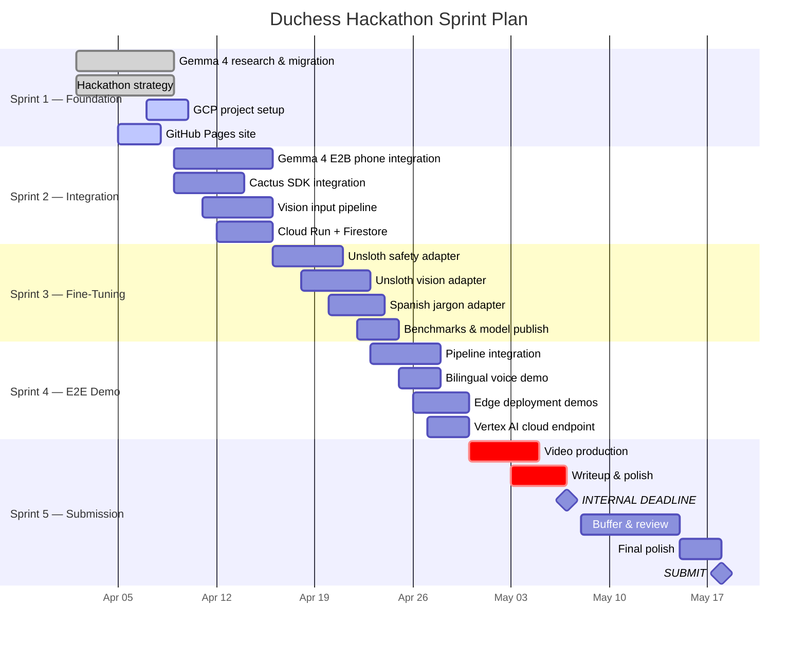

# Sprint Timeline

**Real Deadline**: May 18, 2026 · 11:59 PM UTC  
**Internal Deadline**: May 7, 2026 (11 days buffer for polish and emergencies)  
**Total Duration**: 5 sprints across 7 weeks

---

## Visual Timeline

---

## Sprint Details

### Sprint 1: Foundation (Apr 2–8) — 35 Story Points

**Goal**: Establish research foundation, hackathon strategy, project infrastructure.

| Ticket | Points | Status | Owner |
|:-------|:------:|:------:|:------|
| Gemma 4 model card analysis & research | 3 | ✅ Done | Duke |
| Hackathon strategy document | 5 | ✅ Done | Duke |
| Master stakeholder dossier | 8 | ✅ Done | Duke + Wei |
| Codebase migration Gemma 3n → 4 | 8 | ✅ Done | Alex |
| Local Ollama inference verified | 3 | ✅ Done | Kai |
| GitHub Pages documentation site | 5 | 🔄 Active | Taylor |
| Create GCP project `duchess-hackathon` | 3 | 📋 To Do | Jordan |
| Register team on Kaggle | 1 | 📋 To Do | Duke |
| Install gcloud CLI + SDK | 2 | 📋 To Do | Jordan |

**Velocity**: 27/35 points completed

---

### Sprint 2: Integration (Apr 9–15) — 34 Story Points

**Goal**: Integrate Gemma 4 E2B into the phone app with multimodal vision and function calling.

| Ticket | Points | Status | Owner |
|:-------|:------:|:------:|:------|
| Gemma 4 E2B integration in GemmaInferenceService | 8 | 📋 | Alex |
| Multimodal vision input (camera frames → Gemma 4) | 5 | 📋 | Alex + Kai |
| Native function calling for structured safety output | 5 | 📋 | Alex |
| Cactus SDK integration for multi-tier routing | 5 | 📋 | Alex + Kai |
| GCP Cloud Run API skeleton | 3 | 📋 | Jordan |
| GCP Firestore schema setup | 3 | 📋 | Jordan |
| LiteRT migration (TFLite → LiteRT) | 3 | 📋 | Kai |
| Zero-shot safety benchmarks (baseline) | 2 | 📋 | Priya |

**Acceptance Criteria**:
- [ ] Gemma 4 E2B processes camera frames and returns structured safety JSON
- [ ] Function calling produces typed `classify_ppe_violation(...)` output
- [ ] Cactus router dispatches to correct tier based on complexity
- [ ] Cloud Run API responds to health check
- [ ] Firestore stores and retrieves safety alerts

---

### Sprint 3: Fine-Tuning (Apr 16–22) — 31 Story Points

**Goal**: Fine-tune three domain-specific adapters using Unsloth and publish to Hugging Face.

| Ticket | Points | Status | Owner |
|:-------|:------:|:------:|:------|
| Unsloth QLoRA: safety text adapter | 8 | 📋 | Priya |
| Unsloth QLoRA: safety_vision adapter (multimodal) | 8 | 📋 | Priya + Elena |
| Unsloth QLoRA: spanish_jargon adapter | 5 | 📋 | Priya + Luis |
| Export adapters to GGUF + SafeTensors | 3 | 📋 | Kai |
| Zero-shot vs fine-tuned benchmarks | 5 | 📋 | Priya |
| Publish models to Hugging Face | 2 | 📋 | Priya |

**Acceptance Criteria**:
- [ ] Safety text adapter achieves ≥90% classification accuracy
- [ ] Vision adapter achieves PPE F1 ≥ 0.85
- [ ] Spanish adapter achieves BLEU ≥ 30 on construction terminology
- [ ] All adapters exported to GGUF Q4_K_M and SafeTensors
- [ ] Models published with model cards and benchmarks

---

### Sprint 4: End-to-End Demo (Apr 23–29) — 29 Story Points

**Goal**: Full pipeline working across all tiers with live demonstrations.

| Ticket | Points | Status | Owner |
|:-------|:------:|:------:|:------|
| Full pipeline: glasses → phone → cloud | 8 | 📋 | Alex |
| Bilingual voice input demo (Gemma 4 audio) | 5 | 📋 | Alex + Luis |
| llama.cpp on edge hardware demo | 5 | 📋 | Kai |
| Ollama Mac server demo (Tier 3) | 3 | 📋 | Kai |
| Vertex AI Gemma 4 31B endpoint | 5 | 📋 | Jordan |
| LiteRT NPU benchmarks on Tensor G4 | 3 | 📋 | Kai |

**Acceptance Criteria**:
- [ ] Camera frame flows from glasses → phone (Gemma 4) → cloud (Vertex AI) → alert
- [ ] Spanish voice input produces correct bilingual safety alert
- [ ] GGUF model runs via llama.cpp on phone
- [ ] Ollama serves Gemma 4 26B MoE on Mac with <5s latency
- [ ] Vertex AI endpoint responds in <500ms

---

### Sprint 5: Submission (Apr 30–May 7) — 26 Story Points

**Goal**: Produce all submission deliverables by internal deadline.

| Ticket | Points | Status | Owner |
|:-------|:------:|:------:|:------|
| Record 3-min video demo on construction site | 13 | 📋 | Duke + Maya |
| Write Kaggle writeup (≤1,500 words) | 5 | 📋 | Wei + Duke |
| Architecture diagrams + cover image | 3 | 📋 | Maya |
| Clean up GitHub repo (README, docs, LICENSE) | 3 | 📋 | Taylor |
| Test live demo URL | 2 | 📋 | Sam |

**Acceptance Criteria**:
- [ ] Video is ≤3 minutes, compelling, shows live demos
- [ ] Writeup is ≤1,500 words, covers all evaluation criteria
- [ ] All links work (video, code, demo, models)
- [ ] README has clear setup instructions for reproducibility

---

## Milestones

| Date | Milestone | Status |
|:-----|:----------|:------:|
| Apr 2 | Gemma 4 research complete | ✅ |
| Apr 8 | Sprint 1 complete, GCP project created | 🔄 |
| Apr 15 | Gemma 4 E2B integrated in phone app | 📋 |
| Apr 22 | All three fine-tuned adapters published | 📋 |
| Apr 29 | End-to-end pipeline demonstrated | 📋 |
| **May 7** | **INTERNAL DEADLINE — All deliverables complete** | 📋 |
| May 15 | Final video uploaded to YouTube | 📋 |
| **May 18** | **SUBMIT to Kaggle** | 📋 |

---

## Total Story Points by Sprint

| Sprint | Points | Theme |
|:-------|:------:|:------|
| Sprint 1 | 35 | Foundation & Strategy |
| Sprint 2 | 34 | Model Integration |
| Sprint 3 | 31 | Fine-Tuning |
| Sprint 4 | 29 | E2E Demo |
| Sprint 5 | 26 | Submission |
| **Total** | **155** | |
