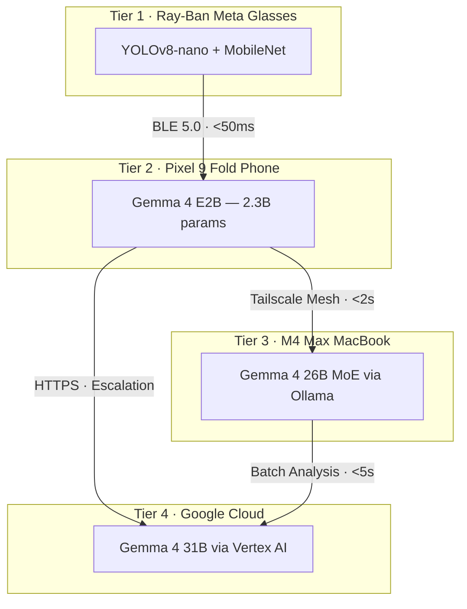

# Duchess
{: .fs-9 }

AI-Powered Construction Safety Platform — Gemma 4 Good Hackathon
{: .fs-6 .fw-300 }

[Get Started](/Duchess/hackathon/overview){: .btn .btn-primary .fs-5 .mb-4 .mb-md-0 .mr-2 }
[View on GitHub](https://github.com/AlexiosBluffMara/Duchess){: .btn .fs-5 .mb-4 .mb-md-0 }

---

## The Problem

**Construction is the deadliest industry in America.** In 2024, **1,056 workers** died on U.S. construction sites. OSHA's "Fatal Four" — falls, struck-by, electrocution, and caught-in/between hazards — account for over 60% of these deaths. Most are preventable with proper PPE compliance.

**30%+ of the construction workforce is Spanish-speaking.** Safety warnings delivered only in English leave a critical gap. Language barriers cost lives.

## Our Solution

Duchess puts **frontier AI on every worker's phone** — running **100% on-device**, privacy-preserving, and bilingual (English/Spanish) — to detect PPE violations and deliver real-time safety alerts.

Built on **Google's Gemma 4** model family, Duchess uses a four-tier inference architecture that scales from AR glasses to cloud:

## Key Capabilities

| Capability | Description |
|:-----------|:------------|
| **On-Device AI** | Gemma 4 E2B runs entirely on the worker's phone. No cloud dependency. Zero per-inference cost. |
| **Bilingual Alerts** | Every safety alert delivered in both English and Spanish. Gemma 4 supports 140+ languages. |
| **Privacy-First** | Video never leaves the construction site unless explicitly escalated through the PPE pipeline. |
| **Multimodal Vision** | Camera frames from AR glasses analyzed directly by Gemma 4's native vision capability. |
| **Voice Reporting** | Workers report hazards verbally in any language via Gemma 4's native audio input. |
| **Explainable Decisions** | Gemma 4's thinking mode produces auditable reasoning chains for safety assessments. |
| **Offline-Capable** | WireGuard mesh keeps all devices connected on-site. Full functionality without internet. |
| **Graceful Degradation** | System continues operating even when higher tiers are unavailable. |

## Hackathon

Duchess is competing in the [**Gemma 4 Good Hackathon**](https://www.kaggle.com/competitions/gemma-4-good-hackathon) on Kaggle, organized by Google DeepMind.

- **Total Prize Pool**: $200,000
- **Deadline**: May 18, 2026
- **Target Tracks**: Main ($50K), Safety & Trust ($10K), Digital Equity ($10K), Cactus ($10K), Unsloth ($10K), LiteRT ($10K)

## Quick Navigation

| Section | Description |
|:--------|:------------|
| [Hackathon Overview](/Duchess/hackathon/overview) | Competition details, rules, prizes, and timeline |
| [Technical: Gemma 4 Deep Dive](/Duchess/technical/gemma4) | Model architecture, benchmarks, deployment strategy |
| [Technical: Architecture](/Duchess/technical/architecture) | Four-tier system design with diagrams and flowcharts |
| [Technical: Unsloth & Quantization](/Duchess/technical/unsloth) | Fine-tuning, model compression, edge deployment |
| [Technical: Meta & Google Stack](/Duchess/technical/meta-google-stack) | Hardware and cloud services breakdown |
| [Project: Sprint Board](/Duchess/project/sprint-board) | Current sprint, backlog, kanban board |
| [Project: Team](/Duchess/project/team) | Team members and roles |

---

## Team

**Authors**: Bhattacharya, Baksi, Lahiri  
**Institution**: Illinois State University  
**Organization**: Alexios Bluff Mara LLC  

**Academic Advisors**: Dr. Mangolika Bhattacharya · Dr. Haiyan Sally Xie

---

*"Every construction worker deserves an AI safety partner that speaks their language."*  
*"Cada trabajador de la construcción merece un compañero de seguridad con IA que hable su idioma."*
