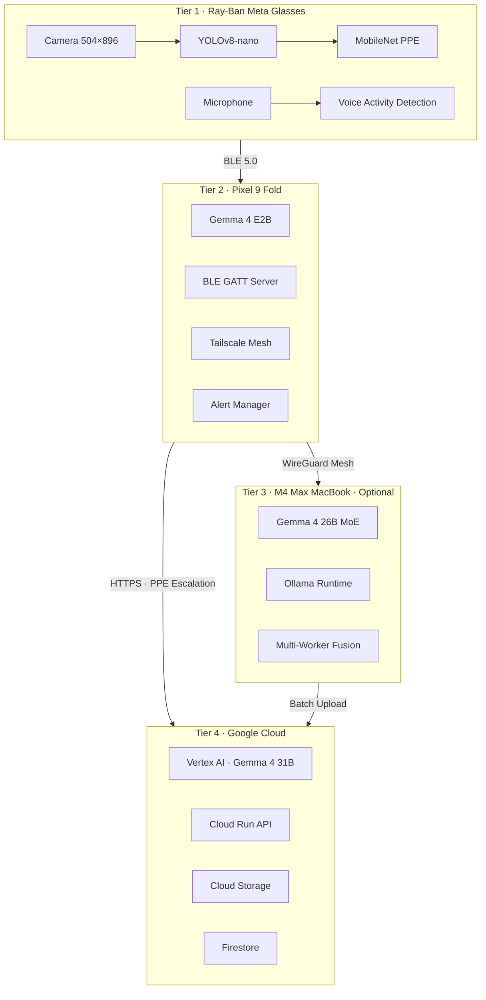
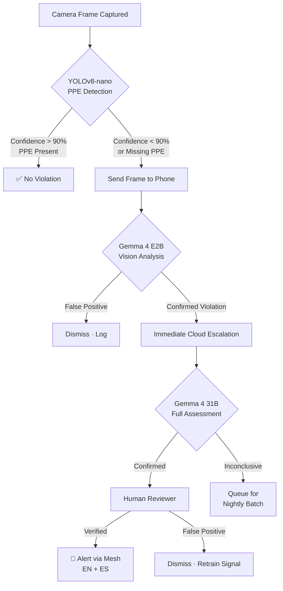
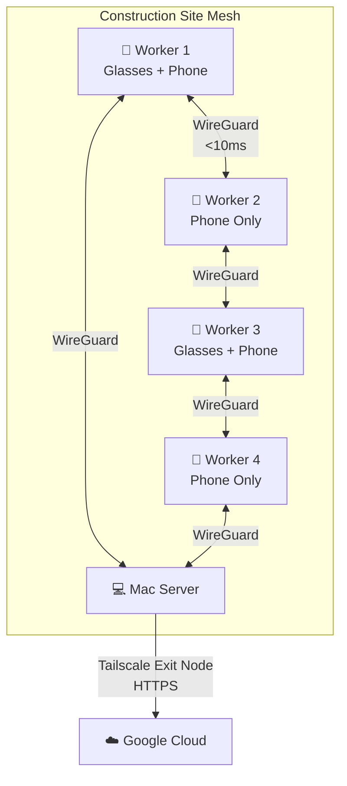
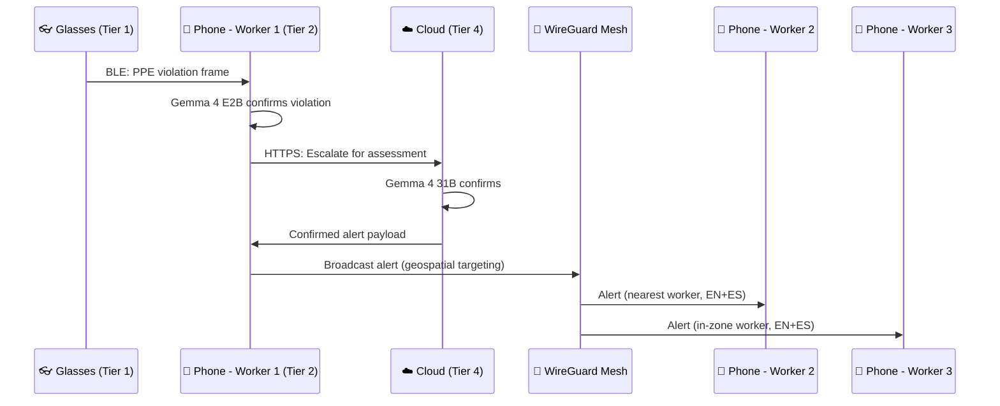
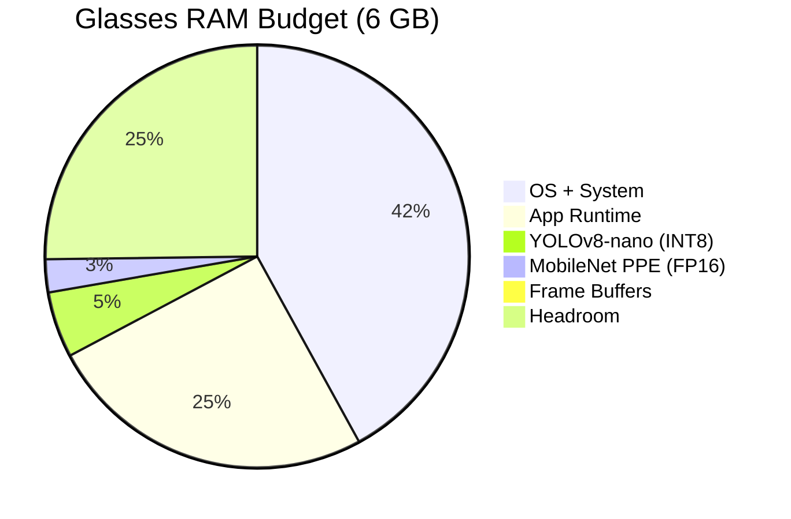
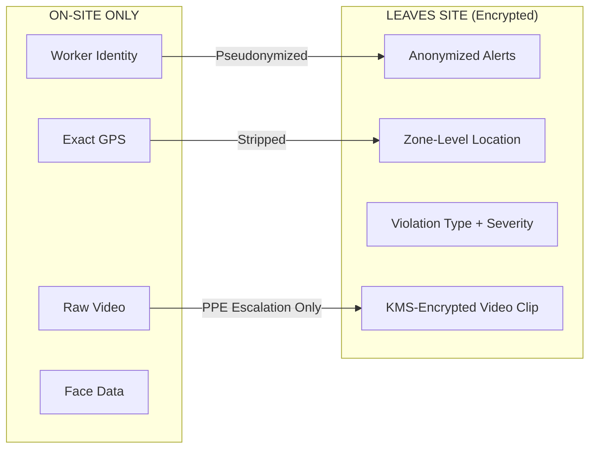
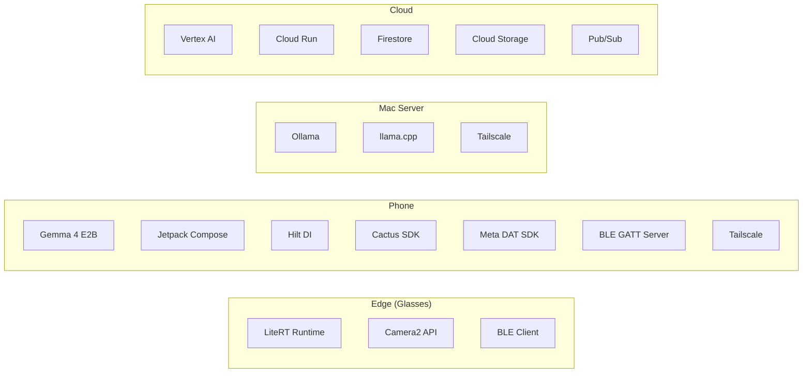
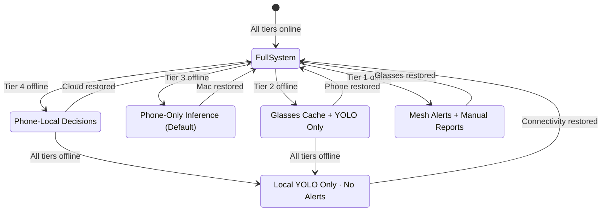
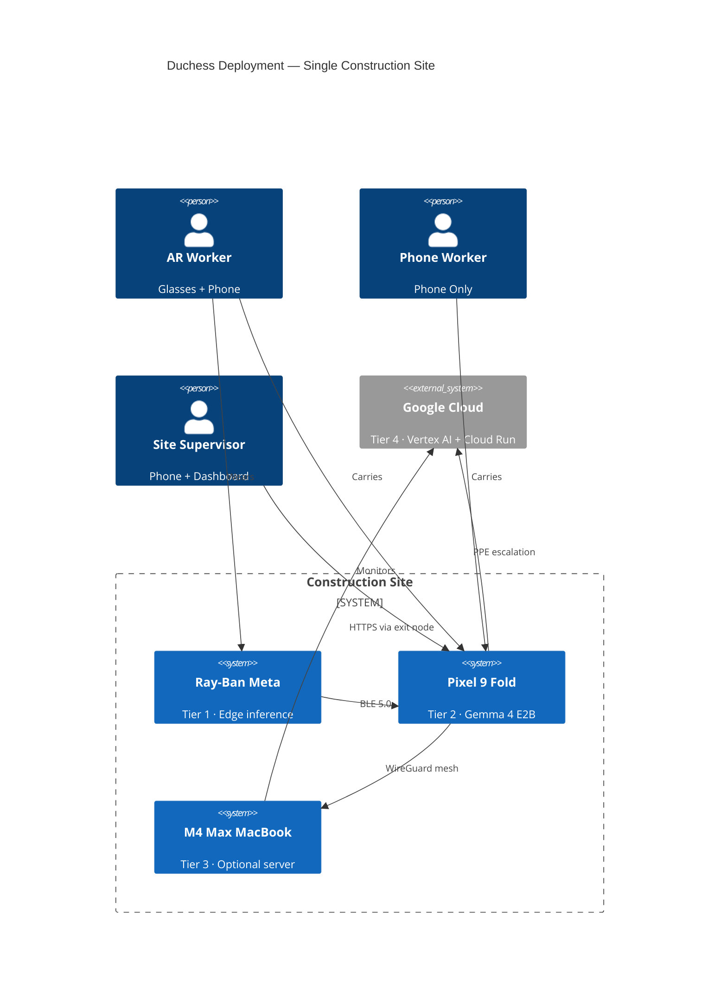

# System Architecture
{: .no_toc }

Duchess is a four-tier AI construction safety platform that runs inference from the edge of a worker's glasses to the cloud — detecting PPE violations, hazards, and safety risks in real time.
{: .fs-6 .fw-300 }

  
Table of contents

  {: .text-delta }
1. TOC
{:toc}

---

## Four-Tier Architecture Overview

Every model, feature, and data flow in Duchess maps to exactly one tier. There is no ambiguity about where code runs.

| Tier | Device | Latency Target | Primary Role |
|------|--------|---------------|--------------|
| **1** | Ray-Ban Meta Glasses | < 50 ms | Real-time PPE detection, barcode scanning |
| **2** | Pixel 9 Fold | < 2 s | NLU, bilingual alerts, triage decisions |
| **3** | M4 Max MacBook | < 5 s | Complex scene analysis, multi-worker fusion |
| **4** | Google Cloud | 100–500 ms | Nightly batch, escalated inference, multi-site orchestration |

---

## PPE Detection Pipeline

The critical path from camera frame to worker alert. This is the core safety loop.

### Latency Budget

```mermaid
gantt
    title PPE Violation → Alert Delivery (Worst Case)
    dateFormat X
    axisFormat %s ms

    section Tier 1
    YOLOv8-nano detection       :0, 40
    BLE frame transfer          :40, 120

    section Tier 2
    Gemma 4 E2B analysis        :120, 1800
    Cloud escalation upload     :1800, 2200

    section Tier 4
    Gemma 4 31B assessment      :2200, 2700
    Human reviewer queue        :2700, 5000

    section Delivery
    Mesh alert broadcast        :5000, 5050
```

> **Target**: Under 5 seconds from frame capture to alert delivery for confirmed violations. Human review adds variable latency.

---

## Data Flow Rules

- **Video NEVER leaves the jobsite** unless escalated through the PPE pipeline OR nightly batch upload
- **Escalation is always upward**: Tier 1 → 2 → 4 (skip Tier 3 for PPE)
- **Tier 3 is optional** — the system fully functions with only Tiers 1, 2, and 4
- **Worker identifiers anonymized** before any data reaches cloud services
- **Location stripped** to zone-level granularity (not exact GPS)
- **No PII in logs** — not in CloudWatch, not in local logs, not in crash reports
- **Bilingual alerts** — every alert includes both English (`messageEn`) and Spanish (`messageEs`)

---

## Mesh Network Topology

All on-site devices communicate over a Tailscale WireGuard mesh. Workers with only phones are first-class participants — **ALL workers have the companion app installed**.

### Mesh Latency Tiers

| Path | Latency | Use Case |
|------|---------|----------|
| Direct peer-to-peer | < 10 ms | Alert delivery between nearby workers |
| Relay through peer | 10–30 ms | Alert delivery across site zones |
| DERP fallback | 50–150 ms | Off-mesh or degraded connectivity |
| Cloud round-trip | 100–500 ms | PPE escalation, batch upload |

### Alert Delivery via Mesh

---

## Device Specifications

| Spec | Ray-Ban Meta | Pixel 9 Fold | M4 Max MacBook |
|------|-------------|-------------|----------------|
| **SoC** | Snapdragon AR1 Gen1 | Tensor G4 | Apple M4 Max |
| **RAM** | 6 GB (500 MB ML budget) | 12 GB | 48 GB unified |
| **Battery** | 750 mAh | 4,650 mAh | Always-on |
| **Camera** | 12 MP, 504×896 @24 fps via DAT SDK | 50 MP rear, 10 MP front | N/A |
| **Display** | Heads-up projection | 7.6" inner / 6.3" outer | 16" Liquid Retina XDR |
| **Connectivity** | BLE 5.0 to phone only | BLE, WiFi, 5G, UWB | WiFi 6E, Thunderbolt |
| **ML Accelerator** | Hexagon DSP | Edge TPU (Gemma-optimized) | Neural Engine (16-core) |
| **OS** | Meta OS | Android 15 | macOS Sequoia |

### ML Model Allocation

---

## Privacy Architecture

Data classification and boundary enforcement. Nothing crosses from "On-Site Only" to the cloud without transformation.

### Data Retention

| Data Type | Storage | Encryption | Retention |
|-----------|---------|------------|-----------|
| Raw video | On-device only | Device encryption | Deleted after upload or 7 days |
| Cloud video | Cloud Storage (KMS) | AES-256 | 90 days |
| Alert metadata | Firestore | Google-managed | 1 year |
| Worker location | Memory only | WireGuard in transit | Session only |
| Safety reports | Firestore + Cloud Storage | Google-managed | 3 years |
| Model weights | Artifact Registry | Encrypted at rest | Indefinite |

---

## Technology Stack

### Key Dependencies

| Layer | Framework | Version | Purpose |
|-------|-----------|---------|---------|
| Glasses | LiteRT | 1.1+ | YOLOv8-nano, MobileNet inference |
| Glasses | Meta DAT SDK | 0.5.0 | Camera streaming from Ray-Ban Meta |
| Phone | Gemma 4 E2B | — | On-device NLU + vision (2.3B effective params) |
| Phone | Cactus SDK | latest | Local LLM runtime for Gemma |
| Phone | Jetpack Compose | BOM 2024+ | UI framework |
| Phone | Hilt | 2.51+ | Dependency injection |
| Phone | Tailscale | — | WireGuard mesh networking |
| Mac | Ollama | latest | Gemma 4 26B MoE runtime |
| Cloud | Vertex AI | — | Gemma 4 31B hosted inference |
| Cloud | Cloud Run | — | Serverless API endpoints |

---

## Graceful Degradation

The system is designed to keep workers safe even when tiers go offline.

| Tier Unavailable | Impact | Behavior |
|-----------------|--------|----------|
| **Tier 4** (Cloud) | No nightly batch, no escalation confirmation | Phone handles all decisions locally, alerts still delivered via mesh |
| **Tier 3** (Mac) | No complex scene analysis | Phone-only inference — already the default path |
| **Tier 2** (Phone down) | No Gemma 4 NLU | Glasses continue YOLO detection, cache alerts locally |
| **Tier 1** (Glasses off) | No AR, no pre-detection | Phone still receives mesh alerts, manual reporting available |

> **Design principle**: A worker wearing glasses with a charged phone always has safety coverage, even with zero network connectivity. YOLO runs fully on-device.

---

## Deployment Topology

---

_Last updated: {{ "now" | date: "%Y-%m-%d" }}_
