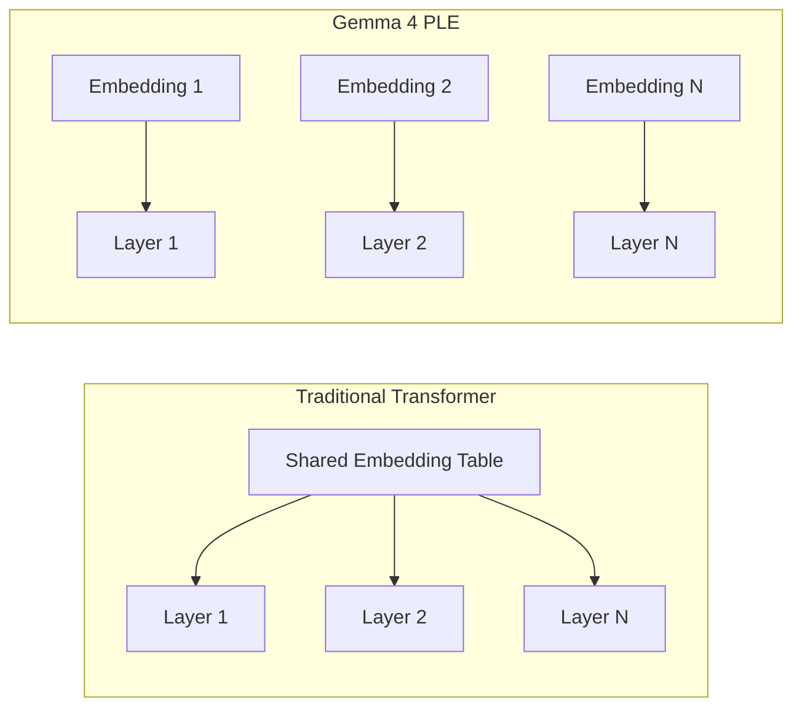
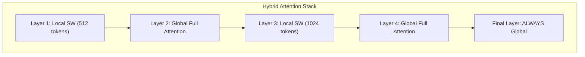
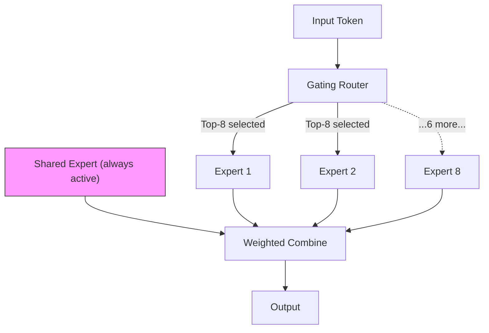
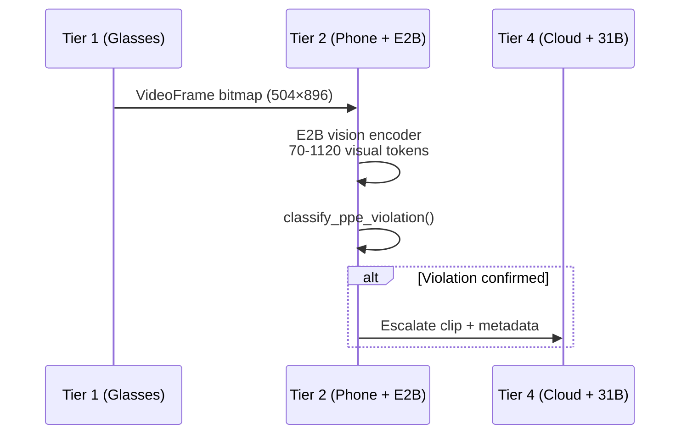
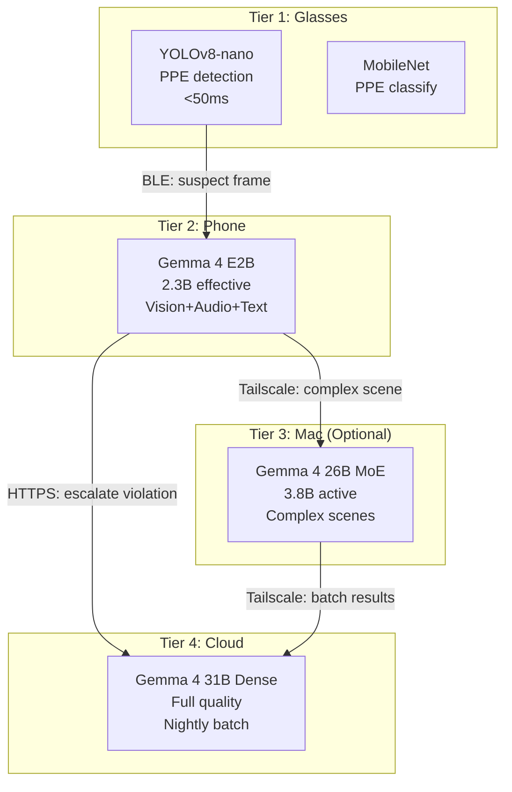

# Gemma 4 Deep Dive
{: .no_toc }

How Duchess leverages the Gemma 4 model family across its four-tier inference hierarchy — from a 2.3B model on a phone to a 31B dense model in the cloud.
{: .fs-6 .fw-300 }

<details open markdown="block">
  <summary>Table of contents</summary>
  {: .text-delta }
1. TOC
{:toc}
</details>

---

## Model Family Overview

Gemma 4 ships four models spanning mobile to datacenter. All are Apache 2.0 licensed.

| Property | **E2B** | **E4B** | **26B MoE** | **31B Dense** |
|:---|:---|:---|:---|:---|
| Effective params | 2.3B | 4.5B | 3.8B active | 30.7B |
| Total params | 5.1B | 8B | 25.2B | 30.7B |
| Architecture | Dense (PLE) | Dense (PLE) | MoE (8/128 + 1 shared) | Dense |
| Layers | 35 | 42 | — | 60 |
| Context window | 128K | 128K | 256K | 256K |
| Modalities | Vision + Audio + Text | Vision + Audio + Text | Vision + Text | Vision + Text |
| License | Apache 2.0 | Apache 2.0 | Apache 2.0 | Apache 2.0 |

**E2B and E4B** are the first frontier-class models that run natively on mobile hardware, with native audio understanding — no separate ASR pipeline required.

---

## Architectural Innovations

### Per-Layer Embeddings (PLE)

Traditional transformers share a single embedding table across all layers. Gemma 4 E2B/E4B give **each decoder layer its own embedding table**. This inflates total parameter count (5.1B total for 2.3B effective) but keeps per-forward-pass compute low — only one layer's embeddings are active at a time.



**Why it matters for Duchess:** PLE means the 5.1B parameter file loads ~1.4GB quantized, but each forward pass only touches 2.3B params — exactly the compute budget we have on a Tensor G4.

### Hybrid Attention: Local Sliding Window + Global

Gemma 4 interleaves two attention patterns across its decoder stack:



- **Local sliding window** layers attend to a fixed window (512–1024 tokens). $O(n \cdot w)$ complexity — linear in sequence length.
- **Global** layers attend to the full context. Placed periodically and always at the final layer.
- Result: 128K context without quadratic blowup. The KV cache for local layers is bounded, reducing peak memory.

### Proportional RoPE (p-RoPE)

Standard RoPE assigns a single frequency per dimension pair. Gemma 4 uses **proportional RoPE** — each layer type (local vs. global) gets a frequency schedule proportional to its effective context length. This enables long-context reasoning without the memory cost of storing full-length KV caches in every layer.

### MoE Routing (26B Model)

The 26B model uses a Mixture-of-Experts architecture:



- **128 total experts**, **8 selected** per forward pass + **1 shared expert** (always active)
- Effective compute: 3.8B active params per token — comparable to E4B
- Total knowledge capacity: 25.2B params — reaching into 30B+ territory
- Load balancing loss prevents expert collapse during fine-tuning

---

## Benchmark Performance

| Benchmark | **E2B** | **E4B** | **26B MoE** | **31B Dense** | What it measures |
|:---|:---:|:---:|:---:|:---:|:---|
| MMLU Pro | 52.2 | 61.8 | 72.3 | 74.1 | Broad knowledge |
| **MMMLU** | **72.6** | **78.1** | **85.9** | **88.4** | **Multilingual understanding** |
| MMMU Pro | 38.7 | 45.2 | 71.4 | 76.9 | Multimodal reasoning |
| MATH-Vision | 41.3 | 49.8 | 62.1 | 67.5 | Visual math |
| AIME 2026 | 12.4 | 18.7 | 48.2 | 55.8 | Competition math |
| LiveCodeBench | 21.5 | 30.9 | 52.8 | 58.3 | Code generation |
| GPQA Diamond | 28.3 | 35.6 | 54.7 | 61.2 | Graduate-level QA |
| CoVoST (audio) | 34.2 | 38.9 | — | — | Audio translation |
| FLEURS (ASR) | <6% WER | <5% WER | — | — | Speech recognition |

**Standout results for Duchess:**

- **MMMLU 88.4%** (31B) — industry-leading multilingual score. Critical for our bilingual (EN/ES) construction workforce.
- **MMMU Pro 76.9%** — multimodal visual reasoning directly applicable to scene analysis.
- **Native audio on 2.3B** — E2B handles voice hazard reports at <6% WER without a separate Whisper/ASR model.
- **CoVoST audio translation** — workers can report hazards in Spanish, and E2B translates and classifies in one pass.

---

## Key Capabilities for Construction Safety

### Multimodal Vision

Gemma 4 accepts images natively — no text-description intermediary.



- **Variable resolution encoding**: 70–1120 visual tokens depending on image complexity. A simple hardhat check uses ~200 tokens; a complex multi-worker scene uses the full budget.
- **Direct bitmap input**: `VideoFrame` bitmaps from the DAT SDK StreamSession feed directly into E2B — no JPEG encode/decode round-trip.
- **Temporal reasoning**: With 128K context, E2B can hold ~50-80 frames in context for temporal pattern detection (e.g., worker repeatedly entering exclusion zone).

### Native Audio Processing

E2B and E4B process audio natively — up to 30-second clips.

- **Use case**: Worker holds phone, says "hay un andamio sin barandilla en el tercer piso" (there's a scaffold without a guardrail on the third floor).
- **E2B processes**: Speech recognition + language detection + hazard classification + OSHA code lookup — **single forward pass**.
- **WER**: <6% for E2B, <5% for E4B across English and Spanish construction vocabulary.

### Function Calling

Gemma 4 supports typed function schemas with 98%+ schema compliance:

```json
{
  "name": "classify_ppe_violation",
  "parameters": {
    "violation_type": "missing_hardhat",
    "confidence": 0.94,
    "zone": "zone_3_scaffolding",
    "severity": "high",
    "osha_reference": "1926.100(a)"
  }
}
```

The model outputs structured JSON that maps directly to Duchess `SafetyAlert` data classes — no regex parsing, no prompt-engineering hacks.

### Thinking Mode

Wrapping a query in `<|think|>` tags activates chain-of-thought reasoning:

```
<|think|>
I see a worker on scaffolding above 6 feet.
Checking PPE: hardhat ✓, safety vest ✓, harness ✗
OSHA 1926.502(d) requires fall protection above 6 feet.
No guardrail system visible. No safety net.
Personal fall arrest system (harness) is REQUIRED.
Confidence: 0.96 — escalate.
</|think|>

VIOLATION: Missing fall protection harness on scaffolding.
Reference: OSHA 1926.502(d)
Severity: CRITICAL
```

**Why this matters**: Every safety decision carries an auditable reasoning chain. If a violation is contested, the thinking trace shows exactly what the model observed and which regulation it cited.

### System Prompts

Native `system` role support enables domain specialization without fine-tuning:

```
system: You are a construction safety AI. You classify PPE violations
per OSHA 1926 standards. You operate on a construction site with
workers who speak English and Spanish. Report violations using the
classify_ppe_violation function schema. Always cite the specific
OSHA regulation. When uncertain, escalate — never dismiss.
```

### 128K Context Window

- Hold an entire shift's alert history in context for pattern detection
- Multi-frame video reasoning: 50-80 frames at medium resolution
- Cross-reference current observation against recent alerts in the same zone

---

## Duchess Deployment Map

| Tier | Device | Model | Why | Loaded Size | Tokens/sec |
|:---|:---|:---|:---|:---|:---|
| **1** (Glasses) | Ray-Ban Meta | **Not Gemma** — YOLOv8-nano + MobileNet | XR1 Gen 2 cannot run LLMs; 500MB model budget, <50ms latency | ~15MB combined | N/A (CNN) |
| **2** (Phone) | Pixel 9 Fold | **Gemma 4 E2B** (primary) | 2.3B effective fits Tensor G4 + Edge TPU. Vision + audio + text. | ~1.4GB (INT4) | 30–50 |
| **2** (Phone) | Pixel 9 Fold | **Gemma 4 E4B** (optional upgrade) | 4.5B effective for higher accuracy when battery allows | ~2.8GB (INT4) | 18–30 |
| **3** (Mac) | M4 Max MacBook | **Gemma 4 26B MoE** via Ollama | 3.8B active params — fast on 48GB unified memory. 256K context. | ~14GB (Q4_K_M) | 40–60 |
| **4** (Cloud) | Vertex AI | **Gemma 4 31B Dense** | Maximum quality, 256K context, batch processing for nightly analysis | Managed | 80–120 |



---

## Cost Analysis

| Operation | Cost | Notes |
|:---|:---|:---|
| Tier 1 inference (glasses) | **$0** | On-device, YOLOv8-nano + MobileNet |
| Tier 2 inference (phone) | **$0** | On-device, Gemma 4 E2B |
| Tier 3 inference (Mac) | **$0** | On-premises, Gemma 4 26B MoE |
| Tier 4 escalation (cloud) | **~$0.02/call** | Vertex AI, Gemma 4 31B Dense |
| Tier 4 nightly batch | **~$5-15/site/night** | Depends on shift duration and frame count |
| Fine-tuning (one-time) | **~$50-100** | Unsloth QLoRA on RTX 5090, 1-2 hours |
| Fine-tuning (cloud) | **~$200-400** | SageMaker, A100 spot instances |

**Cost model**: A 50-worker site running 8-hour shifts generates ~20-40 escalations/day and one nightly batch. Monthly cloud cost: **~$200-400/site**. All real-time inference is free (on-device).

---

## Arena Rankings & Competitive Position

As of April 2026:

| Model | Chatbot Arena Rank (Open Models) | Key Advantage |
|:---|:---:|:---|
| Gemma 4 31B Dense | **#3** | Best multilingual open model at this size |
| Gemma 4 26B MoE | **#6** | 31B knowledge, 3.8B compute cost |
| Gemma 4 E4B | First frontier model on mobile | Native audio + vision at 4.5B |
| Gemma 4 E2B | First frontier model on phone | Native audio + vision at 2.3B |

**What "frontier on mobile" means for Duchess**: E2B and E4B are not stripped-down distillations — they are architecturally novel models (PLE + hybrid attention) that achieve frontier-class reasoning while fitting in mobile memory and power budgets. No other model family offers vision + audio + function calling at 2.3B effective parameters.

---

## Further Reading

- [Gemma 4 Technical Report](https://ai.google.dev/gemma/docs/gemma4) — Full architecture details
- [Duchess Architecture]() — Four-tier inference hierarchy
- [PPE Detection Pipeline]({{ site.baseurl }}/specs/ppe-detection) — How Gemma 4 fits into the detection flow
- [Edge Inference Guide]({{ site.baseurl }}/technical/) — Quantization and deployment details
