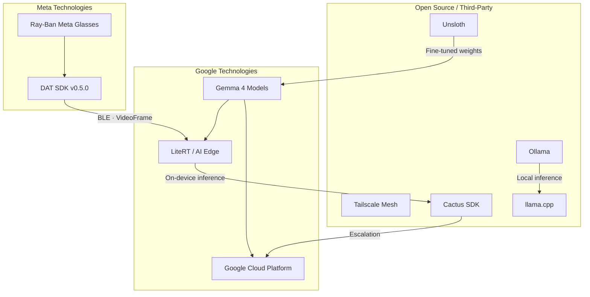

# Meta & Google Stack

## Overview

Duchess uniquely combines technology from both **Meta** and **Google** to create a construction safety platform that neither could build alone. Meta provides the wearable hardware and device access SDK that puts cameras on workers' faces. Google provides the AI models, on-device inference runtime, and cloud infrastructure that makes those cameras intelligent. Together, they enable a real-time PPE detection pipeline that runs from smart glasses to cloud — with safety-critical latency under 2 seconds.

---

## Meta Technologies

### Ray-Ban Meta Smart Glasses

Camera-equipped smart glasses worn by construction workers on-site. The Ray-Ban Meta platform provides the eyes of the Duchess system — capturing continuous video of the work environment without requiring workers to hold a device or interrupt their tasks.

- **Camera**: 12MP ultra-wide, video streaming via Bluetooth Classic
- **Connectivity**: BLE 5.0 to companion phone
- **OS**: Meta OS with Developer Mode for third-party access
- **Form factor**: Standard Wayfarer frame — workers wear them like regular safety glasses
- **Battery**: Sufficient for a full shift with optimized streaming settings

### DAT SDK v0.5.0

The **Meta Wearables Device Access Toolkit** is how Duchess communicates with the Ray-Ban Meta glasses. The SDK is organized into three modules:

| Module | Purpose |
|--------|---------|
| `mwdat-core` | Device discovery, registration, permissions, device selectors |
| `mwdat-camera` | StreamSession, VideoFrame, photo capture, resolution control |
| `mwdat-mockdevice` | MockDeviceKit for development and testing without hardware |

**Key SDK patterns used throughout Duchess:**

- `DatResult<T, E>` for type-safe error handling (never `getOrThrow()`)
- `StateFlow` / `Flow` for reactive state observation
- `suspend` functions for all async operations — no callbacks
- `AutoDeviceSelector` for automatic glasses pairing
- `StreamConfiguration` for resolution (360p–720p) and frame rate (2–30 FPS)

### TRIBE v2 (Research Reference)

Meta's multimodal brain-encoding foundation model that predicts fMRI brain responses to video, audio, and text stimuli. Built on LLaMA 3.2 (text), V-JEPA2 (video), and Wav2Vec-BERT (audio). Licensed CC-BY-NC-4.0 with 25.7K downloads on HuggingFace.

**Relevance to Duchess:** Potential research angle for understanding worker cognitive responses to safety alerts. TRIBE v2 could help optimize alert effectiveness by predicting neural engagement patterns — ensuring that PPE violation warnings actually capture attention in noisy construction environments.

> **Note:** The non-commercial license (CC-BY-NC-4.0) means TRIBE v2 cannot be used in the commercial Duchess product. It is referenced here for academic positioning and future research directions only.

---

## Google Technologies

### Gemma 4 Model Family

Open model family from Google DeepMind, available under the **Apache 2.0** license. Gemma 4 is the primary AI backbone of Duchess, running at every tier of the inference hierarchy.

| Variant | Parameters | Duchess Tier | Use Case |
|---------|-----------|--------------|----------|
| E2B | 2.3B effective | Tier 2 (Phone) | NLU, bilingual alerts, PPE triage |
| E4B | 4.5B effective | Tier 2/3 | Enhanced scene understanding |
| 26B MoE | 26B mixture-of-experts | Tier 3 (Mac) | Complex multi-worker analysis |
| 31B Dense | 31B dense | Tier 4 (Cloud) | Full PPE assessment, batch analysis |

All variants support vision + audio + text multimodal input. See our [Gemma 4 deep dive](gemma4) for benchmarks, quantization details, and deployment configurations.

### Google Cloud Platform

Duchess uses GCP as its cloud backbone (Tier 4):

| Service | Role in Duchess |
|---------|----------------|
| **Vertex AI** | Gemma 4 31B hosting for cloud inference, model fine-tuning pipelines |
| **Cloud Run** | Serverless API for PPE escalation handler and REST endpoints |
| **Cloud Storage (GCS)** | KMS-encrypted video storage, model artifacts, safety reports |
| **Firestore** | Alert metadata, safety reports, device registry |
| **Pub/Sub** | Alert queue, batch processing triggers, escalation events |
| **Secret Manager** | API keys, tokens, credentials — never hardcoded |
| **Cloud Monitoring** | Observability, alerting, latency dashboards |
| **Cloud KMS** | Encryption keys for video data at rest (AES-256) |

### LiteRT (Google AI Edge)

Google's next-generation on-device ML framework, evolved from TensorFlow Lite. LiteRT powers Duchess's on-device inference on Pixel 9 Fold hardware.

- **NPU acceleration** for Tensor G4 chip — hardware-optimized inference
- **CompiledModel API** for automated hardware selection (CPU/GPU/NPU)
- **LiteRT-LM** for on-device generative AI (Gemma 4 E2B inference)
- Successor to TFLite with improved performance and broader hardware support

### Google Workspace Integration

| Tool | Use |
|------|-----|
| Google Sites | Public demo page for hackathon judges |
| Google Docs | Collaborative writeup drafting |
| Google Sheets | Benchmark tracking and model comparison |
| Google Drive | Media gallery staging for demo videos |

---

## Third-Party Integrations

### Tailscale

WireGuard-based mesh VPN connecting all devices on the construction site. Tailscale is the nervous system of Duchess — every phone, every server, and the cloud gateway communicate through encrypted Tailscale tunnels.

- **Direct peer latency**: <10ms between phones on-site
- **Encryption**: WireGuard — keys managed by org (Tailscale cannot decrypt)
- **Access control**: Tag-based ACLs per device role (glasses, phone, server, admin)
- **Failover**: Direct peer → relay through peers → DERP fallback (50–150ms)

### Unsloth

Fine-tuning platform used to adapt Gemma 4 for construction safety domains. 30x faster training, 90% less VRAM via Dynamic QLoRA. Produces domain-adapted weights for PPE detection vocabulary, construction jargon, and Spanish safety terminology.

### Ollama

Local LLM runtime for the optional Tier 3 Mac server. Verified configurations:

- Gemma 4 E2B: 7.2 GB VRAM
- Gemma 4 E4B: 9.6 GB VRAM

### llama.cpp

C/C++ inference engine (101K GitHub stars). Used for GGUF format model export and efficient CPU/GPU inference. Powers the quantized model deployment pipeline.

### Cactus

On-device inference SDK with intelligent cloud fallback. Y Combinator backed. Provides hybrid routing — runs inference locally when possible, falls back to cloud when the model or input exceeds device capability.

---

## Integration Architecture

---

## Why Both Meta AND Google?

Neither company's stack alone covers the full pipeline from camera to cloud inference. Meta owns the wearable hardware; Google owns the AI models and cloud. Duchess bridges the two.

| What | From Meta | From Google |
|------|-----------|-------------|
| **Hardware** | Ray-Ban Meta glasses (camera, sensors) | Pixel 9 Fold (Tensor G4, Edge TPU) |
| **SDK** | DAT SDK (device streaming) | LiteRT (on-device ML) |
| **Models** | — | Gemma 4 (E2B, E4B, 26B, 31B) |
| **Cloud** | — | Vertex AI, Cloud Run, Firestore |
| **Research** | TRIBE v2 (neuroscience) | Gemma model research |

Meta gives us the **eyes** on every worker. Google gives us the **brain** to understand what those eyes see. The open-source ecosystem (Tailscale, Unsloth, Ollama, llama.cpp, Cactus) provides the **connective tissue** that makes the full pipeline practical, fast, and deployable on real construction sites.
