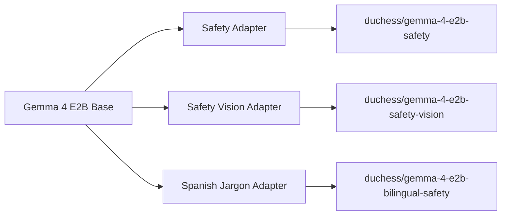
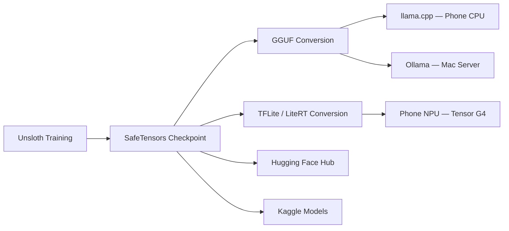

# Unsloth & Quantization
{: .fs-8 }

Fine-tuning Gemma 4 with Unsloth Dynamic QLoRA and quantizing for edge deployment across the Duchess four-tier architecture.
{: .fs-5 .fw-300 }

---

## Unsloth Overview

[Unsloth](https://unsloth.ai) is a high-performance fine-tuning framework created by **Daniel and Michael Han** that delivers **30x faster training** than FlashAttention-2 with **90% less VRAM** through custom CUDA kernels written from scratch. Unlike wrapper libraries, Unsloth manually derives backpropagation steps and rewrites GPU kernels to eliminate memory overhead at the hardware level.

Unsloth supports multiple fine-tuning methods:

- **LoRA / QLoRA / Dynamic QLoRA** — Parameter-efficient fine-tuning with quantized base weights
- **FFT (Full Fine-Tuning)** — All parameters updated, for maximum quality when compute allows
- **FP8 Training** — 8-bit floating point for Hopper/Ada GPUs
- **Dynamic QLoRA** — Unsloth's proprietary method claiming **0% accuracy degradation** vs full LoRA while using 2–4x less memory than standard QLoRA

With **500+ supported models** (including Gemma 4, Llama 4, Qwen 2.5, Phi-4, Mistral), Unsloth is the only framework with confirmed Dynamic QLoRA support for Gemma 4 E2B.

---

## Key Features

### Unsloth Studio

A **100% offline** desktop application for Mac and Windows. No data leaves your machine. Provides real-time training observability: loss curves, learning rate schedules, gradient norms, and token throughput — all rendered locally without cloud telemetry.

### Data Recipes

Automated dataset preparation via a graph-node workflow. Accepts raw **PDFs, CSV, JSON, text files** and transforms them into properly formatted instruction-tuning datasets. Handles deduplication, tokenization auditing, and train/val/test splitting without manual scripting.

### Model Arena

Side-by-side comparison of **base vs. fine-tuned** model outputs on identical prompts. Supports blind evaluation mode for unbiased quality assessment. Critical for validating that domain adaptation improved target-task performance without catastrophic forgetting.

### Export Formats

| Format | Runtime | Use Case |
|--------|---------|----------|
| SafeTensors | PyTorch / HF Transformers | Training checkpoints, Tier 4 cloud |
| GGUF | llama.cpp / Ollama | Tier 2 phone (CPU), Tier 3 Mac server |
| vLLM | vLLM server | High-throughput cloud inference |
| TFLite / LiteRT | TensorFlow Lite | Tier 2 phone (NPU via MediaPipe) |

### Faster MoE Training

Optimized expert routing kernels for Mixture-of-Experts architectures. Reduces MoE overhead by fusing expert selection and dispatch into single kernel launches, relevant for Gemma 4's MoE variants.

---

## Duchess Fine-Tuning Plan

We train **three domain adapters** on top of the Gemma 4 E2B base (2.3B effective parameters, 5.1B with embeddings):

### Adapter 1: Safety (Text)

| Parameter | Value |
|-----------|-------|
| **Dataset** | OSHA incident reports + construction safety standards text corpus |
| **Method** | Dynamic QLoRA, rank r=16, alpha=32, dropout=0.05 |
| **Target Modules** | q_proj, k_proj, v_proj, o_proj, gate_proj, up_proj, down_proj |
| **Objective** | Safety classification accuracy ≥ 90% on held-out OSHA test set |
| **Training Time** | ~14–18 hours on a single RTX 5090 |
| **Learning Rate** | 2e-4 with cosine annealing, 10% warmup |
| **Batch Size** | Effective batch size 16 (gradient accumulation 4 × micro-batch 4) |

This adapter teaches the model OSHA regulation vocabulary, hazard classification taxonomy (Fatal Four categories), and construction-specific safety reasoning chains.

### Adapter 2: Safety Vision

| Parameter | Value |
|-----------|-------|
| **Dataset** | Roboflow Construction Site Safety (5,641 images, 10 classes) + HardHat-Vest v3 (44K images) |
| **Method** | Dynamic QLoRA with vision encoder layers unfrozen |
| **Target** | PPE detection F1 ≥ 0.85 across all 10 classes |
| **Classes** | Hardhat, Safety Vest, NO-Hardhat, NO-Safety Vest, Person, Goggles, Gloves, Mask, Boots, NO-Mask |
| **Training Time** | ~20–24 hours on RTX 5090 |
| **Augmentation** | Random crop, horizontal flip, color jitter, simulated dust/fog |

Vision adapter enables multimodal PPE assessment — the model receives a video frame and returns structured detection results with bounding boxes and confidence scores.

### Adapter 3: Spanish Jargon

| Parameter | Value |
|-----------|-------|
| **Dataset** | OSHA Spanish-language materials (~100 pages) + construction jargon corpus |
| **Method** | Dynamic QLoRA, rank r=16, alpha=32 |
| **Target** | Spanish BLEU ≥ 30, construction terminology accuracy ≥ 95% |
| **Vocabulary** | Terms like *casco* (hardhat), *arnés* (harness), *andamio* (scaffold), *gafas de seguridad* (safety goggles) |
| **Training Time** | ~8–12 hours on RTX 5090 |

This adapter does not teach the model Spanish from scratch — Gemma 4 already supports multilingual generation. Instead, it calibrates the model's Spanish output to use **construction-register terminology** rather than general-purpose translations, and aligns safety classification behavior across both languages.

---

## Quantization Strategy

After fine-tuning, models are quantized for deployment across tiers. Lower-bit formats trade marginal quality for dramatic size and speed gains:

| Format | Size | Speed | Quality | Target Device |
|--------|------|-------|---------|---------------|
| BF16 (base) | ~4.6 GB | 1× | 100% | Training only |
| Q8_0 (GGUF) | ~2.3 GB | 1.5× | ~99% | Mac server (Tier 3) |
| Q4_K_M (GGUF) | ~1.4 GB | 2.5× | ~95% | Phone — primary (Tier 2) |
| Q4_0 (GGUF) | ~1.2 GB | 3× | ~92% | Phone — battery saver (Tier 2) |
| INT8 (TFLite/LiteRT) | ~2.3 GB | 2× | ~98% | Phone NPU (Tier 2) |
| INT4 (LiteRT) | ~1.2 GB | 3× | ~93% | Phone NPU, low power (Tier 2) |

**Q4_K_M** is the primary phone deployment format — it uses k-quant mixed precision (important weights kept at higher precision) to preserve 95% of base quality at 1.4 GB. For NPU-accelerated inference on the Pixel 9's Tensor G4, **INT8 TFLite/LiteRT** is the target format, leveraging hardware quantization support.

**Selection logic on the phone app:**

1. NPU available + sufficient battery → INT8 LiteRT
2. NPU available + low battery → INT4 LiteRT
3. CPU-only fallback → Q4_K_M GGUF via llama.cpp
4. Critical battery saver → Q4_0 GGUF

---

## Export Pipeline

The export flow converts Unsloth training checkpoints into deployment-ready artifacts for each tier:

**Pipeline steps:**

1. **Unsloth → SafeTensors**: Training produces adapter weights in SafeTensors format. Merge adapter into base model using `unsloth.save_pretrained_merged()`.
2. **SafeTensors → GGUF**: Convert via `llama.cpp/convert_hf_to_gguf.py`. Apply quantization: `llama-quantize model-f16.gguf model-q4_k_m.gguf Q4_K_M`.
3. **SafeTensors → TFLite/LiteRT**: Convert through `ai_edge_torch` or MediaPipe Model Maker. Calibrate INT8 quantization with 500 representative samples from the training distribution.
4. **Publish**: Push all artifacts to Hugging Face Hub and Kaggle Models with model cards, benchmark results, and training configs.

---

## Special Technology Prizes

Duchess is engineered to compete for **four sponsor technology prizes** simultaneously:

### Unsloth Prize — $10,000
{: .text-purple-000 }

**Best fine-tuned Gemma 4 model using Unsloth.** Our deliverables: three published adapters (Safety, Safety Vision, Spanish Jargon) with full training configs, ablation studies, benchmark comparisons against zero-shot baselines, and reproducible training notebooks on Kaggle.

### LiteRT Prize — $10,000
{: .text-blue-000 }

**On-device Gemma 4 inference via LiteRT.** Duchess runs Gemma 4 E2B through LiteRT with NPU acceleration on the Pixel 9's Tensor G4 SoC. INT8 quantized model achieving <2s latency for safety classification with hardware delegate.

### llama.cpp Prize — $10,000
{: .text-green-000 }

**GGUF-exported Gemma 4 on resource-constrained hardware.** Q4_K_M quantized model running on phone CPU via llama.cpp C library, proving viability on devices without NPU support. Submission includes latency benchmarks, memory profiling, and quality retention metrics.

### Ollama Prize — $10,000
{: .text-yellow-000 }

**Gemma 4 served via Ollama on the Mac server (Tier 3).** Already verified: E2B at 7.2 GB and E4B at 9.6 GB running under Ollama on M4 Max. Submission demonstrates real-time construction scene analysis with multi-worker video fusion served through Ollama's API.

---

## Benchmark Plan

Every adapter is evaluated against its zero-shot baseline. No adapter ships without measurable improvement and no regression on general capabilities:

| Metric | Zero-Shot Baseline | Fine-Tuned Target | Evaluation Dataset |
|--------|-------------------|-------------------|-------------------|
| Construction PPE F1 | ~50% | ≥ 85% | Roboflow Construction Site Safety (test split) |
| Safety Classification Accuracy | ~60% | ≥ 90% | OSHA incident reports (held-out 20%) |
| Spanish Construction BLEU | ~70% | ≥ 85% | OSHA ES materials + manual translations |
| Construction Terminology Accuracy | ~75% | ≥ 95% | Curated 200-term bilingual glossary |
| On-device Latency (Pixel 9) | ~3–4s | < 2s | 100 representative safety prompts |
| Peak Memory Usage | ~1.4 GB | ~1.2 GB (Q4_K_M) | Android Profiler measurement |

**Evaluation protocol:**

1. Hold out 20% of each dataset as a test set — never seen during training
2. Run zero-shot baseline on the exact same test set before training begins
3. Evaluate fine-tuned model on the same test set after training completes
4. Report metrics with 95% confidence intervals (bootstrap resampling, n=1000)
5. Run cross-dataset generalization: train on Roboflow, evaluate on HardHat-Vest
6. Publish all results in the model card alongside training hyperparameters

---

## Free Compute Resources

| Resource | GPU / Accelerator | RAM | Session Limit | Use Case |
|----------|-------------------|-----|---------------|----------|
| Kaggle Notebooks | T4 × 2 (16 GB each) | 29 GB | 12 hrs / session | QLoRA training, evaluation |
| Kaggle Notebooks | P100 (16 GB) | 29 GB | 12 hrs / session | Fallback training |
| Kaggle Notebooks | TPU v3-8 | 96 GB HBM | 9 hrs / session | Large batch evaluation |
| Local Workstation | RTX 5090 (64 GB VRAM) | 128 GB DDR5 | Unlimited | Primary training, full experiments |
| Local MacBook | M4 Max (48 GB unified) | 48 GB | Unlimited | MLX inference testing, Ollama |

**Training strategy:** Develop and debug on Kaggle T4s (free, reproducible). Run final training on the RTX 5090 for maximum throughput. Validate Ollama / MLX inference on the M4 Max MacBook.

---

## Published Models

All fine-tuned models are published on **Hugging Face Hub** and **Kaggle Models** under the Duchess organization:

| Model | Hub ID | Format | Size |
|-------|--------|--------|------|
| Safety (Text) | `duchess/gemma-4-e2b-safety` | SafeTensors + GGUF + LiteRT | ~1.2–4.6 GB |
| Safety Vision | `duchess/gemma-4-e2b-safety-vision` | SafeTensors + GGUF + LiteRT | ~1.4–5.2 GB |
| Spanish Jargon | `duchess/gemma-4-e2b-bilingual-safety` | SafeTensors + GGUF | ~1.2–4.6 GB |

Each published model includes:

- **Model card** with architecture details, intended use, limitations, and ethical considerations
- **Benchmark results** table with zero-shot vs. fine-tuned comparisons
- **Training configuration** (full Unsloth config YAML, hyperparameters, random seed)
- **Inference notebook** (Kaggle-ready, one-click reproducible)
- **License**: Apache 2.0 (matching Gemma 4 license terms)

---

## Datasets

| Dataset | Source | Size | Classes | License | Use |
|---------|--------|------|---------|---------|-----|
| Construction Site Safety (Roboflow) | [Kaggle](https://www.kaggle.com/datasets/snehilsanyal/construction-site-safety-image-dataset-roboflow) | 227 MB, 5,641 images | 10 (Hardhat, Vest, Goggles, etc.) | CC BY 4.0 | Primary PPE training + evaluation |
| Safety Helmet Detection | [Kaggle](https://www.kaggle.com/datasets/andrewmvd/hard-hat-detection) | 1 GB | Helmet / No Helmet | Public | Helmet detection fine-tuning |
| HardHat-Vest v3 | [Kaggle](https://www.kaggle.com/datasets) | 5 GB, 44K images | Hardhat + Vest | Public | Large-scale PPE augmentation |
| OSHA Safety Standards (ES) | [OSHA.gov](https://www.osha.gov/spanish) | ~100 pages | — | Public Domain | Spanish construction terminology |

**Dataset preparation pipeline:**

1. Download and verify checksums for all datasets
2. Convert annotations to unified COCO format (bounding boxes + class labels)
3. Deduplicate across datasets (perceptual hashing, threshold 0.95)
4. Split: 70% train / 10% validation / 20% test (stratified by class)
5. Generate Unsloth-compatible instruction-tuning JSONL from image–annotation pairs
6. Version the final dataset with DVC and publish the split manifest

---

*Last updated: {{ "now" | date: "%Y-%m-%d" }}*
